# Pass C — Auth & Session Lifecycle

This pass covers how a Teacher comes into existence, proves their identity on each request, and ceases to exist. It also defines what "demo mode" is architecturally, since Pass B's write paths depended on that definition.

## Scope and non-scope

**In scope:**
- Sign-up (account creation)
- Sign-in (credential verification → session)
- Forgot password → reset
- Sign-out
- Delete account
- Demo mode lifecycle
- How session identity flows into every write path from Pass B
- Active-course switch as a session-adjacent concept

**Out of scope (deliberately):**
- Specific auth provider (Supabase, Auth0, Clerk, custom). CLAUDE.md forbids provider-specific assumptions at this stage. This document describes the **contract** the auth layer must meet; the provider is an implementation choice.
- Email templates, password policy, rate limiting, MFA. These are operational concerns layered on top of the lifecycle.
- Session token format (JWT vs. opaque), refresh token rotation, cookie vs. header transport. All implementation-level.

---

## 0. Load-bearing assumptions

These are stated up-front because the rest of the document depends on them. Each one is flagged rather than silently baked in.

| # | Assumption | Why I'm defaulting this way | How to invalidate |
|---|---|---|---|
| A1 | `Teacher.id` equals the auth provider's user id (same UUID on both sides). | Standard pattern; ERD has no separate `auth_user_id` column, so the two must be the same value. | If you want Teacher and auth-user to be separately identified, add `Teacher.auth_user_id uuid UNIQUE` to the ERD. |
| A2 | Credentials (password hashes, reset tokens, email verification tokens) live in the auth provider, **not** in our schema. | ERD has no password column and no token columns on Teacher. | Valid as-is. Don't add credential columns to Teacher. |
| A3 | Every API call that writes data includes a verified session token. The API extracts `teacher_id` from the token and uses it as the `caller` referenced throughout Pass B. | This is what Pass B's "caller" means operationally. | If unauthenticated writes are ever needed (e.g. a public share link that accepts comments), that path would not go through the teacher-scoped write paths. Not currently in the inputs. |
| A4 | **Email verification is required before sign-in is permitted.** Sign-up creates only the auth record; the Teacher + TeacherPreference rows are created on first verified sign-in. | User decision. | To drop verification, collapse §1 into a single bootstrap-at-sign-up flow. |
| A5 | **On first verified sign-in, a Welcome Class is auto-seeded** from the demo-seed JSON (per final Q45 = D, Q47 = A). Teacher lands in a populated gradebook; can delete the Welcome Class anytime. | User decision. | To revert to empty-state home, drop the seed step from §1.3. |
| A6 | **Access + refresh token model (Supabase default).** Short-TTL access token (~30 min) + long-TTL refresh token (~7 days). On 401, client calls `refreshSession()` silently and retries. Only when the refresh token itself expires does the user see a re-auth prompt. | Industry-standard OAuth2 pattern; ships with Supabase out of the box; survives offline periods (critical for `offline-sync.md`). | Single-token sliding-window would require custom middleware and breaks offline reconnect. |

---

## 1. Sign-up (two-phase, verification required)

Trigger: Rows 3–6, 10–13. Teacher fills name / email / password / confirm → Submit.

### 1.1 Phase 1 — Create the auth record

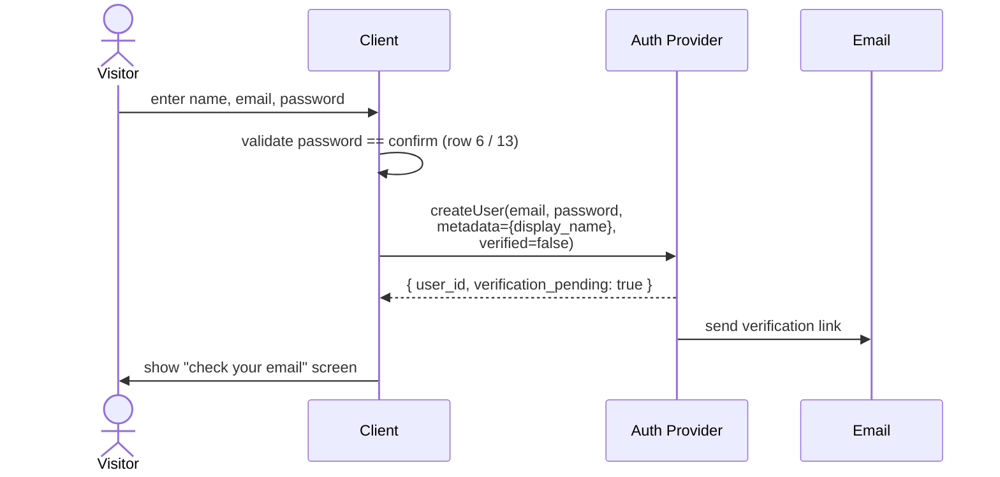

**No Teacher row is written in this phase.** Our database has nothing yet. The user's `display_name` lives only in the auth provider's user_metadata at this point.

### 1.2 Phase 2 — Verify email (out of band)

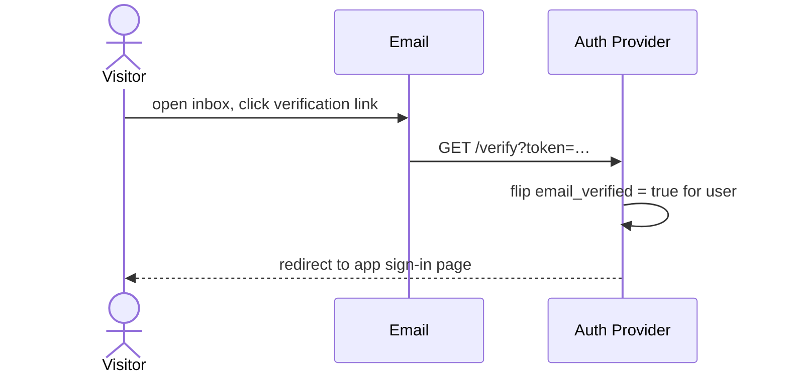

**Still no domain writes.** Verification is entirely an auth-provider concern.

### 1.3 Phase 3 — First verified sign-in creates the Teacher row

This is the same path as §2 (sign-in) with its "missing Teacher row" recovery branch taken. Writing it out explicitly here so the full sign-up flow is visible end-to-end:

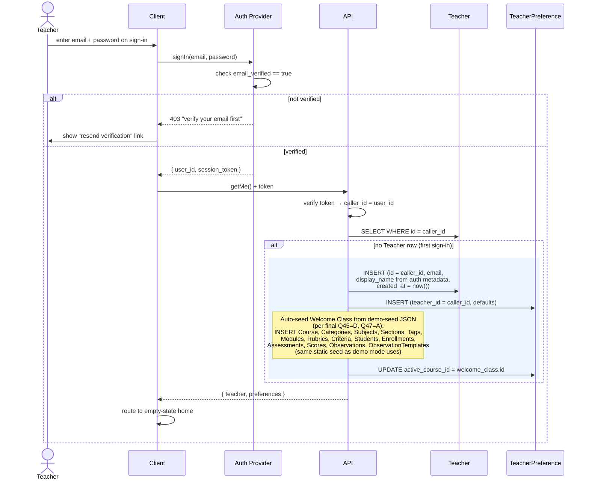

### Why this structure

- **No orphan Teacher rows.** People who sign up but never verify leave nothing behind in our DB. All abandonment lives on the auth provider's side.
- **Two-system atomicity is no longer a problem.** Sign-up touches only the auth provider (one system, one transaction). Teacher creation happens in one DB transaction on first sign-in. The two are sequenced by the user, not the code.
- **`bootstrapTeacher` is idempotent by construction.** If the first sign-in succeeds at the auth layer but the Teacher INSERT fails, the next sign-in sees no Teacher row and retries. If Teacher INSERT succeeded but TeacherPreference INSERT failed, the rectangle rolls both back.
- **`display_name` authoritative copy.** The ERD stores it on Teacher (§1.3 reads it from auth metadata on first sign-in and copies it in). After that, Teacher is the source of truth; auth metadata is a stale mirror. If the user later edits their display name, the write goes to Teacher only — we do **not** keep auth metadata in sync.

**Resend-verification flow:** Not inventoried in the 313 inputs, but implied by the verification requirement. Assumed to be a button on the "verify your email" screen that re-invokes the auth provider's send-verification endpoint. No domain writes.

---

## 2. Sign-in (returning teacher)

Trigger: Rows 1–2, 8–9. Teacher who has previously completed the sign-up flow (including §1 verification) enters email/password → Submit.

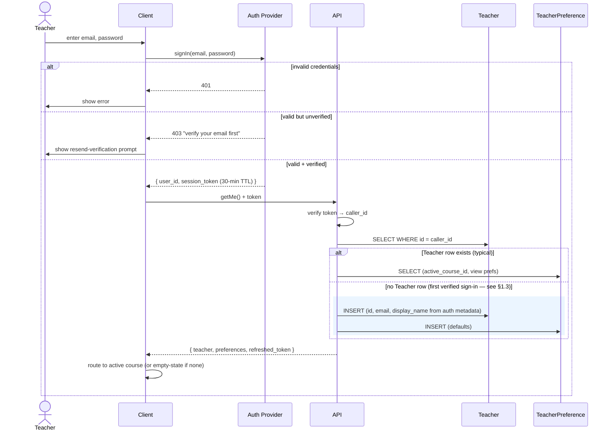

**No domain writes on a clean returning sign-in.** `updated_at` on Teacher is not bumped by sign-in — that field tracks edits, not access.

**Token refresh starts immediately.** The API's response in the "valid + verified" branch includes a fresh 30-minute token. Every subsequent successful API call does the same — this is the sliding-window mechanism from A6.

**`active_course_id` safety check.** If the stored active course no longer exists (e.g. deleted from another device), the client treats it as NULL and routes to the empty-state home. Referenced again in §7.

---

## 3. Forgot password → reset

Trigger: Row 7 (enter email in forgot dialog).

### 3.1 Request reset

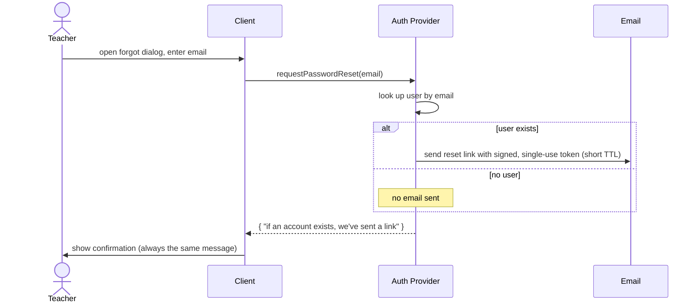

**Account-enumeration resistance.** The response is the same message whether the email matched a user or not. Required, not optional.

### 3.2 Reset landing page

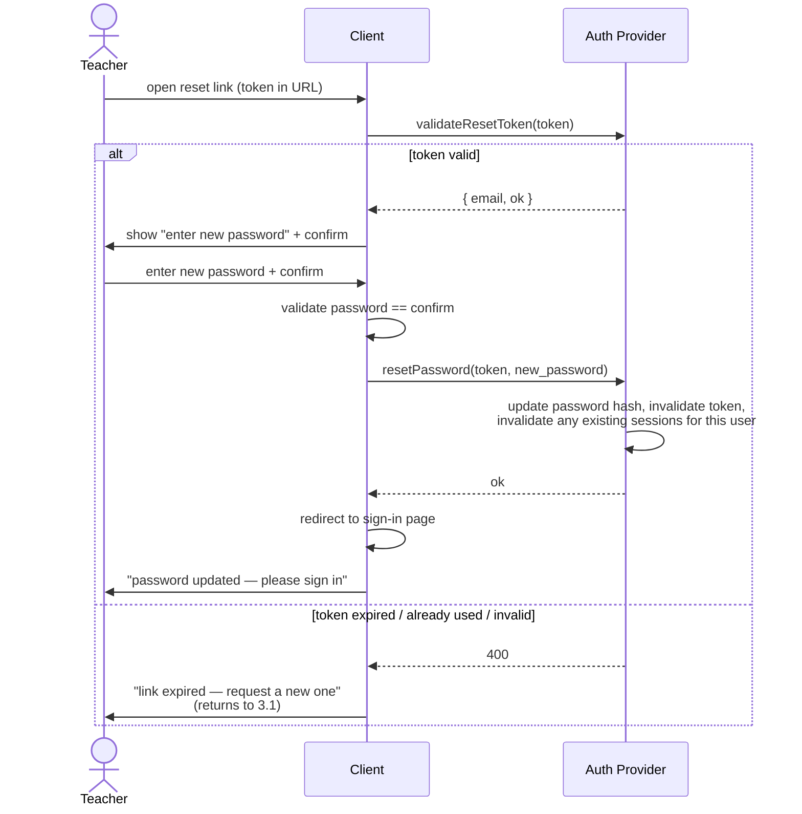

**No domain writes anywhere in §3.** This is entirely an auth-provider flow. The Teacher row is untouched — password hashes don't live there (A2).

**Security choices baked in:**
- Reset tokens are **single-use** — consuming one invalidates it, so a leaked email can't be replayed.
- Resetting a password **invalidates all existing sessions** for that user. If the account was compromised, attackers holding a live token are kicked out at reset. The teacher signs in fresh on the redirect.
- Redirecting to sign-in rather than auto-signing-in is deliberate: after a password change, requiring a fresh sign-in confirms the new password works and prevents "resetter is not the owner" edge cases.

---

## 4. Sign-out

Trigger: Rows 14–15. The input note says "Clears session + LS."

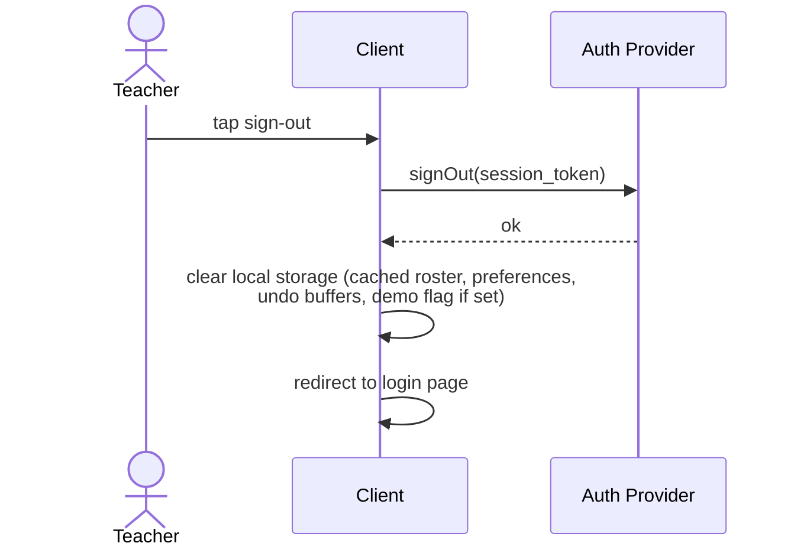

**No domain writes.** Sign-out never touches Teacher, TeacherPreference, or any other entity.

**The "LS" clear is important and has a gotcha.** Local storage may hold unsaved drafts (e.g. a half-typed observation, undo buffers for scores). Sign-out **drops** these. If that's not desired, the client must flush pending writes to the API before initiating sign-out. Not currently in the inputs, but worth flagging as a design boundary: **any write that hasn't reached the API by the time sign-out fires is lost.**

---

## 5. Delete account (soft-delete with 30-day grace)

Trigger: Row 16. Final decision: **soft-delete with 30-day grace** (per Q29 = A).

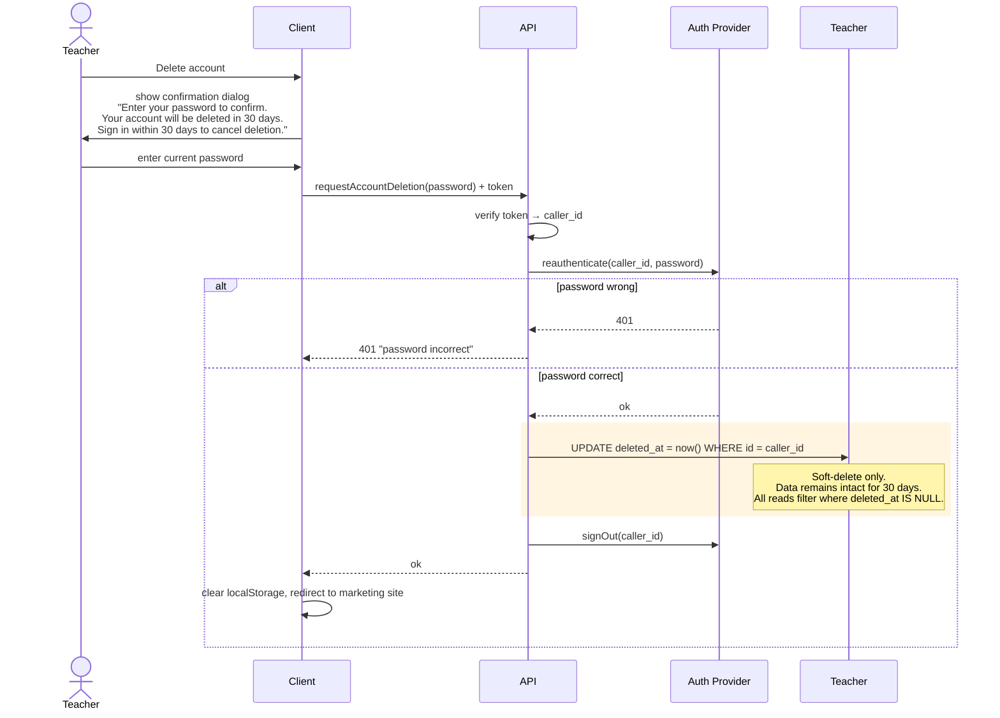

**Cancel deletion within the grace period:** if the user signs in via §2 before the 30-day window closes, the sign-in flow detects `Teacher.deleted_at IS NOT NULL`, prompts: *"Your account is scheduled for deletion. Restore it?"* — and on confirm, runs `UPDATE Teacher SET deleted_at = NULL`.

**Hard-delete cleanup job:** a scheduled Supabase Edge Function runs daily:

```sql
-- Called via Supabase cron extension daily at 03:00 UTC
DELETE FROM Teacher
WHERE deleted_at IS NOT NULL
  AND deleted_at < now() - interval '30 days';
-- Cascades through all teacher-scoped entities per Pass B §5.6.
```

The cleanup job is idempotent and the cascade delete is the same one documented in Pass B — just deferred by 30 days.

**Why soft-delete beats the prior hard-delete design:**
- Recovery: "I deleted my account by mistake" becomes fixable. The sign-in path (§2) detects the soft-delete flag and offers restoration.
- Two-system atomicity: auth provider only gets a `signOut`, not a `deleteUser`. No orphan auth records during the grace window.
- Data audit: during the grace period, an admin can still query the teacher's data if disputes arise.
- Post-cleanup: after 30 days, the full cascade still happens (same effect as immediate hard-delete, just delayed).

**Ordering choice: domain first, then auth.** Reasoning:

- Domain delete is the thing the user *actually wants* (their data gone). Doing it first guarantees the destructive step happens even if the secondary step fails.
- If auth delete fails, the worst outcome is an orphan auth record that can't be signed into usefully (the §2 sign-in flow would try to bootstrap a new Teacher row, but a user actively deleting their account is not going to sign in again in that window). This is recoverable via ops cleanup.
- The reverse ordering (auth first) would leave a worse failure mode: data persists in the DB with no way to sign in and delete it. User-visible ghost.

**Password re-entry is enforced at the API layer, not just the client.** The client's confirmation dialog prevents casual mistakes; the `reauthenticate` call prevents session-hijack abuse (an attacker with a stolen session token still needs the password to delete).

**Soft-delete is still on the table as a safer alternative.** Adding `Teacher.deleted_at` to the ERD (not currently present) would let this path become: flip `deleted_at`, then a background job does the cascading hard delete after a grace period. That's the industry-best pattern but requires schema change and a cleanup job. Flagged as remaining open question #1.

---

## 6. Demo mode — client-only, writes evaporate on sign-out

**Decision:** Demo mode is 100% client-side. The backend is never called. Demo data lives in the browser. Everything is thrown away on sign-out.

**What a demo user can do (per product spec):**
- Explore a seeded class with seeded assignments (read).
- Create new assignments during the session. They render, they work, they don't survive sign-out.
- Create new classes during the session. Same — ephemeral.
- All of Pass B's write paths appear to function inside the demo session, but the target is a client-side store, not the real API.

**What a demo user cannot do:**
- Sign up, verify email, or interact with the auth provider.
- Persist anything.
- Collide with any real teacher's data.

### 6.1 Enter demo mode

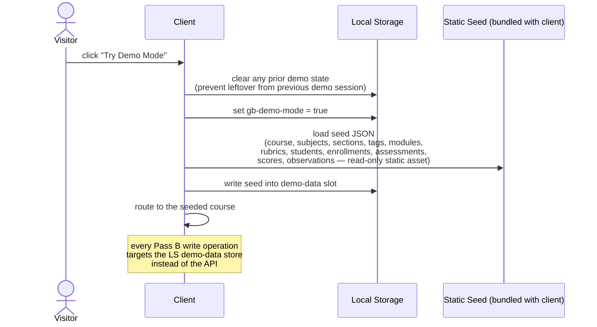

**No API call, no auth session, no token.** The demo-mode flag in localStorage replaces the session token as the "you are acting" marker. The client's data layer reads that flag and routes writes to a local store rather than an HTTP call.

### 6.2 Demo session activity

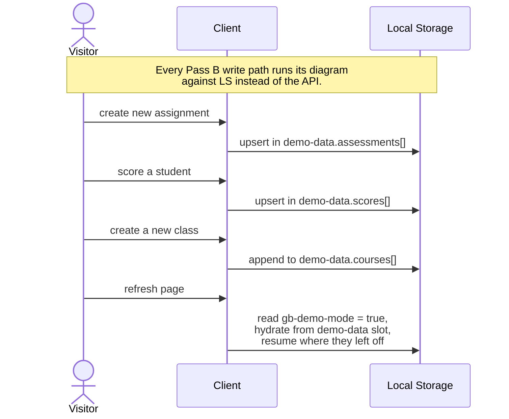

**Data survives page refresh within the session.** Because it's in localStorage, closing and reopening the tab does not wipe demo data. Only explicit sign-out (§6.3) or re-entering demo mode (§6.1) clears it.

**No 30-minute timeout in demo mode.** The idle timeout (A6) is enforced at the API layer. Demo mode doesn't call the API, so there's no token to expire. A demo user can sit idle for hours and pick up where they left off — reasonable for an exploration mode.

### 6.3 Exit demo (sign-out / convert to real account)

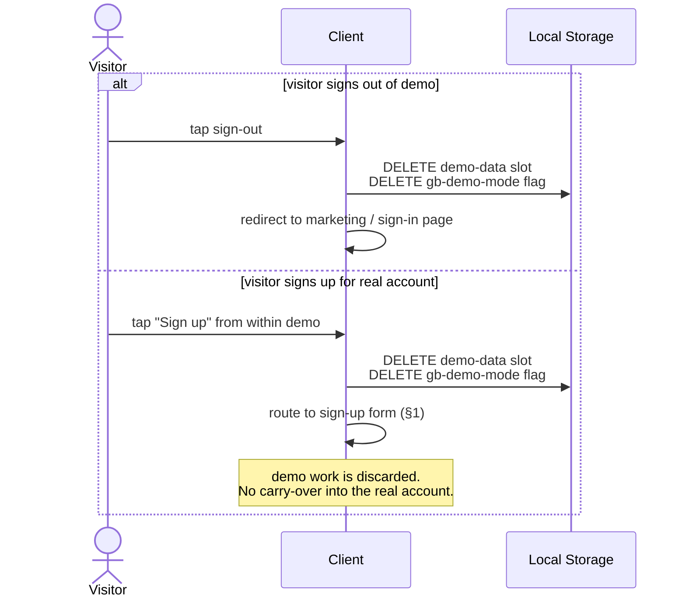

**Demo work cannot be carried into a real account.** This is a product choice, not an engineering limitation — if you later want "save your demo work to a real account," it becomes a new feature: iterate the demo-data store and replay every entity through the real Pass B write paths in topological order (essentially the same logic as Pass B §15.3 JSON import).

### 6.4 What this means for Pass B §16.1

**Pass B §16.1 as previously diagrammed is wrong.** It showed a backend-driven demo reset. Under this design, "reset demo data" in demo mode is:

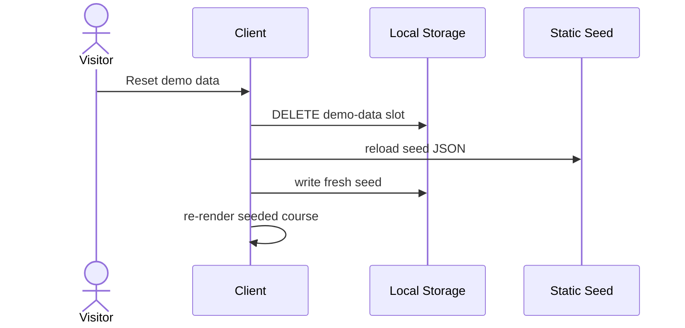

This update is applied to Pass B separately.

### 6.5 Demo-flag safety

One real risk with the "flag in localStorage decides real vs. demo" pattern: a bug that leaves `gb-demo-mode = true` set on a real teacher's browser would route their writes to localStorage instead of the API, silently losing data.

Safeguards the client must enforce:

1. **Flag is cleared on every sign-in (§2).** Opening a real session cannot coexist with an active demo flag — sign-in success always clears it.
2. **Flag is cleared on every sign-out (§4 and §6.3).** Regardless of which mode was active.
3. **Presence of a valid session token takes precedence over the demo flag.** If both are present (anomaly), the client signs out and forces a re-authentication.

These are client-side invariants but they matter — they're the difference between "demo is a cleanly isolated mode" and "demo is a data-loss landmine."

---

## 7. Active-course switch

Trigger: Rows 27–28, 46. This is session-adjacent because "the course I'm currently looking at" feels like session state, but per the ERD it's **persisted preference** (TeacherPreference.active_course_id).

The write itself is diagrammed in Pass B §1.1 and §3. In this doc, only the session implication matters:

**Active course survives sign-out.** When a teacher signs back in, they land in the same course they were last in. If that course was deleted in between (unlikely — same teacher — but possible), the sign-in response (§2) must tolerate `active_course_id` pointing at a non-existent course. The safe handling:

- On sign-in read, if `active_course_id` doesn't resolve to a course owned by the caller, treat it as NULL and route to the empty-state home.
- The client may then prompt the teacher to pick a course.

This is the only place the session / preference boundary gets subtle. Calling it out rather than relying on it being "obvious."

---

## 8. How every Pass B write path gets its `teacher_id` (and how the 30-min timeout is enforced)

Referenced from Pass B but worth stating explicitly here so the boundary is clear:

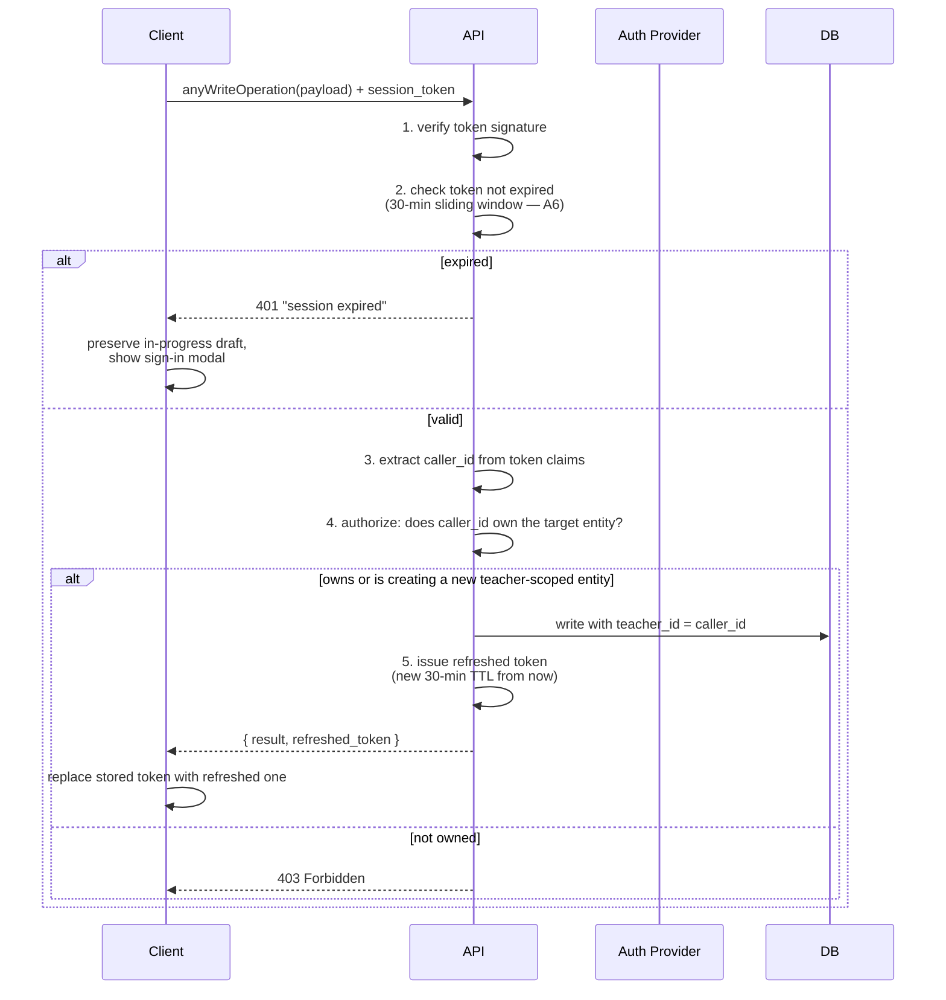

**The authorization step is non-negotiable.** Every Pass B write path says "Teacher edits X" — the API must prove that the session's `caller_id` actually owns X before writing. For top-level entities (Course, Student), this is a straight `WHERE teacher_id = caller_id` check. For deeper entities (Score, ObservationTag), the check walks up the FK chain to the owning Teacher.

Two ways to implement the ownership walk:
- **Application-layer check:** the API code performs an ownership query before each write.
- **Database-layer check:** row-level security policies in the database enforce ownership regardless of what the API code does.

The second is safer (belt-and-braces: a bug in API code can't leak data across teachers) but implementation-specific. Either is acceptable; **some form of enforcement is mandatory.**

### 8.1 Access + refresh token mechanics (A6)

**On sign-in, Supabase issues two tokens:**

- **Access token** (~30-minute TTL). Sent on every API request as `Authorization: Bearer <token>`.
- **Refresh token** (~7-day TTL). Stored client-side; used to mint new access tokens without user interaction.

**On a request with an expired access token:**

1. API returns 401.
2. Client's auth wrapper calls `supabase.auth.refreshSession()` with the refresh token.
3. **Refresh succeeds** → new access + refresh tokens issued → client retries the original request silently. User sees no interruption.
4. **Refresh fails** (refresh token itself expired or revoked) → client shows re-auth prompt. Re-entry of credentials required.

**Result:**
- Active user: access tokens rotate silently in the background every ~30 min. Zero friction.
- User returning within ~7 days: silent refresh on first request; no re-auth prompt.
- User returning after ~7+ days of inactivity: re-auth prompt.

**Why this matters for offline support ([offline-sync.md](offline-sync.md)):** a teacher offline for 45 minutes has an expired access token on reconnect. The queue-drain engine hits 401 on the first queued write → silently refreshes → proceeds. No re-auth interruption unless they've been offline for a full week. This is why we picked refresh tokens over a single sliding-window token.

**Refresh-token rotation:** each successful refresh issues a new refresh token and invalidates the previous one (Supabase default). This catches stolen refresh tokens: if an attacker uses a token before the legitimate client does, the legitimate client's next refresh fails and signals compromise.

**Draft preservation on mid-edit expiry — tiered approach.**

The current UI (`shared/supabase.js:240-256`) shows a **toast** saying "Session expired" with a "Sign In" button, then redirects to `/login.html`. Unsaved drafts are lost. This is acceptable for most surfaces (gradebook score entry, roster edits, settings) because the individual edits are small and easily re-done.

**Path A — default (matches existing UI):** silent refresh first; toast + redirect only on refresh failure. Applies to all surfaces except the two flagged below.

```
On 401:
  attempt silent refreshSession()
  if refresh succeeded:
    retry original request with new access token
    (user sees nothing)
  if refresh failed (refresh token also expired or revoked):
    show toast "Session expired — Sign in again"
    redirect to /login.html after 3 seconds (or immediate on click)
```

**Path B — draft preservation for long-form text surfaces:** applies ONLY to the term-rating narrative editor and the observation capture. These are the two places where a teacher may type for 10+ minutes before saving, and a lost draft is a genuine pain point.

```
On 401 in term-rating narrative or observation capture:
  1. attempt silent refreshSession() (same as Path A)
  2. if refresh succeeded → retry write, user sees nothing
  3. if refresh failed:
     a. do NOT destroy the current form state
     b. show modal overlay: "Session expired — enter password to continue"
        (email pre-filled from the expired token's claim)
     c. on successful re-auth: retry the failed write with the new token
     d. on dismiss or re-auth failure: keep the draft visible with a copy button
        so the teacher can paste the text somewhere safe before the page reloads
```

**Why this tier split:** Building full draft preservation across every edit surface is a large UI investment. Limiting it to the two surfaces where the pain is high gives ~90% of the value for ~10% of the work. All other surfaces keep the existing toast behavior.

**What "inactivity" means is an API concern, not a client one.** The client cannot be trusted to "log out after 30 min" on its own — a malicious client could just… not. The 30-minute window is enforced by the token's server-signed expiry claim.

---

## 9. Complete session timeline

Putting it all together, a representative teacher's lifetime:

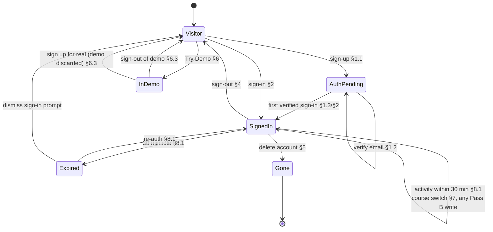

**Each transition maps to exactly one write path**, which is the property we wanted from this three-pass process. No lifecycle event is handled in two places.

---

## 10. Remaining open questions after Pass C

All five ambiguities flagged at the start of Pass C are now resolved. The ones still open are genuinely about implementation-adjacent decisions, not lifecycle shape:

1. **Soft-delete for account-level entities.** §5 uses hard-delete with cascade. Adding `Teacher.deleted_at` (and a grace period with a cleanup job) would make account deletion recoverable within, say, 30 days. Requires an ERD change. **Recommend: yes, eventually — but not a launch blocker.**
2. **Ownership enforcement location.** §8 allows either application-layer or database-layer ownership checks. Decide before implementation. **Recommend: both** — DB-level row security as the backstop, application-layer checks for clearer error messages.
3. **Demo-to-real upgrade path.** §6 explicitly says demo work is discarded on conversion. If product later wants carry-over, it's a net-new feature equivalent to an auto-fill of every Pass B write path with the demo store's contents.

---

## 11. What Pass C still does *not* answer

Being honest about remaining gaps that touch the session contract but aren't session-shape decisions:

- **Rate limiting** (sign-in brute force, password reset flooding, verification email spamming). Operational, not design. Auth-provider features usually cover this.
- **Multi-device sign-in conflicts.** Teacher signed in on desktop and mobile simultaneously, edits the same score in both. Last-write-wins is the default throughout Pass B (`updated_at = now()` on every upsert). No conflict detection. Acceptable for a single-teacher app; would need revisiting if collaborative editing is ever introduced.
- **Multi-device simultaneous sessions.** §3.2 invalidates all sessions on password reset. §8.1 refresh is per-token, so two devices each have their own sliding window. Neither diagram specifies an explicit cap on concurrent sessions (e.g. "only one device at a time"). Currently unconstrained.
- **Audit log.** No entity in the ERD captures "who did what when" beyond each row's `updated_at`. If you ever need to answer "why did this score change?" or reconstruct a disputed grade history, you'll need an audit table. Flagged in Pass A's soft-delete note; still unresolved.
- **Data export on account deletion.** §5 destroys everything immediately. Jurisdictions with data-portability rules (GDPR) require an export option before deletion. Not in the inputs; flagged for product/legal.

None of these block a first implementation — they're the next layer of hardening.


---

> **Last verified 2026-04-20** against `gradebook-prod` + post-merge `main` (Phase 5 doc sweep, reconciliation plan 2026-04-20).
