# Pass A -- Entity-Relationship Design

## ER Diagram

```mermaid
erDiagram

    %% ── Core ──────────────────────────────────────────────

    Teacher ||--o| TeacherPreference : "has"
    Teacher ||--o{ Course : "owns"
    Teacher ||--o{ Student : "creates"

    Course ||--o| ReportConfig : "has"
    Course ||--o{ Enrollment : "contains"
    Course ||--o{ Category : "has"
    Course ||--o{ Subject : "has"
    Course ||--o{ CompetencyGroup : "has"
    Course ||--o{ Section : "has"
    Course ||--o{ Module : "has"
    Course ||--o{ Rubric : "has"
    Course ||--o{ Assessment : "has"
    Course ||--o{ Observation : "has"
    Course ||--o{ CustomTag : "has"
    Course ||--o{ ObservationTemplate : "has"

    Student ||--o{ Enrollment : "enrolled via"

    %% ── Learning Map ──────────────────────────────────────

    Subject ||--o{ Section : "contains"
    CompetencyGroup ||--o{ Section : "groups"
    Section ||--o{ Tag : "contains"

    %% ── Rubrics ───────────────────────────────────────────

    Rubric ||--o{ Criterion : "has"
    Criterion }o--o{ Tag : "linked via CriterionTag"

    %% ── Assessments ───────────────────────────────────────

    Assessment }o--o| Rubric : "uses"
    Assessment }o--o| Module : "belongs to"
    Assessment }o--o| Category : "in"
    Assessment }o--o{ Tag : "linked via AssessmentTag"

    %% ── Scoring ───────────────────────────────────────────

    Enrollment ||--o{ Score : "receives"
    Assessment ||--o{ Score : "scored by"

    Enrollment ||--o{ RubricScore : "receives"
    Assessment ||--o{ RubricScore : "scored by"
    RubricScore }o--|| Criterion : "for"

    Enrollment ||--o{ TagScore : "receives"
    Assessment ||--o{ TagScore : "scored by"
    Tag ||--o{ TagScore : "for"

    %% ── Observations ──────────────────────────────────────

    Observation }o--o| Assessment : "context"
    Observation }o--o{ Enrollment : "about (via ObservationStudent)"
    Observation }o--o{ Tag : "tagged (via ObservationTag)"
    Observation }o--o{ CustomTag : "tagged (via ObservationCustomTag)"

    ObservationTemplate }o--o{ Tag : "default tags"

    %% ── Student-level records ─────────────────────────────

    Enrollment ||--o{ Note : "has"
    Enrollment ||--o{ Goal : "has"
    Enrollment ||--o{ Reflection : "has"
    Enrollment ||--o{ SectionOverride : "has"
    Enrollment ||--o{ Attendance : "has"
    Enrollment ||--o{ TermRating : "has"

    Goal }o--|| Section : "for"
    Reflection }o--|| Section : "for"
    SectionOverride }o--|| Section : "for"

    %% ── Term Ratings ──────────────────────────────────────

    TermRating ||--o{ TermRatingDimension : "has"
    TermRatingDimension }o--|| Section : "for"
    TermRating }o--o{ Tag : "strengths (via TermRatingStrength)"
    TermRating }o--o{ Tag : "growth (via TermRatingGrowthArea)"
    TermRating }o--o{ Assessment : "mentions (via TermRatingAssessment)"
    TermRating }o--o{ Observation : "mentions (via TermRatingObservation)"

    %% ── Entities ──────────────────────────────────────────

    Teacher {
        uuid id PK
        text email
        text display_name
        timestamp created_at
        timestamp deleted_at "nullable; soft-delete marker, 30-day grace"
    }

    TeacherPreference {
        uuid teacher_id PK "FK → Teacher"
        uuid active_course_id "FK → Course, nullable"
        text view_mode
        text mobile_view_mode
        text mobile_sort_mode
        jsonb card_widget_config
    }

    Course {
        uuid id PK
        uuid teacher_id FK "FK → Teacher"
        text name
        text grade_level
        text description
        text color
        boolean is_archived
        int display_order
        text grading_system "proficiency | letter | both"
        text calc_method "average | median | mostRecent | highest | mode | decayingAvg"
        numeric decay_weight
        text timezone "IANA tz, e.g. America/Vancouver"
        text late_work_policy "free-text; human-readable, not enforced"
        timestamp created_at
        timestamp updated_at
    }

    Category {
        uuid id PK
        uuid course_id FK "FK → Course"
        text name
        numeric weight "0-100; teacher-set percentage, UI hard-caps sum at 100"
        int display_order "within course"
        timestamp created_at
        timestamp updated_at
    }

    Student {
        uuid id PK
        uuid teacher_id FK "FK → Teacher"
        text first_name
        text last_name
        text preferred_name
        text pronouns
        text student_number
        text email
        date date_of_birth
        timestamp created_at
        timestamp updated_at
    }

    Enrollment {
        uuid id PK
        uuid student_id FK "FK → Student"
        uuid course_id FK "FK → Course"
        text_arr designations "IEP MOD etc"
        int roster_position
        boolean is_flagged
        timestamp withdrawn_at "nullable; null = active"
        timestamp enrolled_at
        timestamp updated_at
    }

    Subject {
        uuid id PK
        uuid course_id FK "FK → Course"
        text name
        int display_order "within course"
        timestamp created_at
        timestamp updated_at
    }

    CompetencyGroup {
        uuid id PK
        uuid course_id FK "FK → Course"
        text name
        text color
        int display_order "within course"
        timestamp created_at
        timestamp updated_at
    }

    Section {
        uuid id PK
        uuid course_id FK "FK → Course (denormalized)"
        uuid subject_id FK "FK → Subject"
        uuid competency_group_id "FK → CompetencyGroup, nullable"
        text name
        int display_order "within subject"
        timestamp created_at
        timestamp updated_at
    }

    Tag {
        uuid id PK
        uuid section_id FK "FK → Section"
        text code
        text label
        text i_can_text
        int display_order "within section"
        timestamp created_at
        timestamp updated_at
    }

    Module {
        uuid id PK
        uuid course_id FK "FK → Course"
        text name
        text color
        int display_order "within course"
        timestamp created_at
        timestamp updated_at
    }

    Rubric {
        uuid id PK
        uuid course_id FK "FK → Course"
        text name
        timestamp created_at
        timestamp updated_at
    }

    Criterion {
        uuid id PK
        uuid rubric_id FK "FK → Rubric"
        text name
        text level_4_descriptor
        text level_3_descriptor
        text level_2_descriptor
        text level_1_descriptor
        numeric level_4_value "default 4; teacher-adjustable"
        numeric level_3_value "default 3; teacher-adjustable"
        numeric level_2_value "default 2; teacher-adjustable"
        numeric level_1_value "default 1; teacher-adjustable"
        numeric weight "default 1.0; normalized across rubric at read time"
        int display_order "within rubric"
        timestamp created_at
        timestamp updated_at
    }

    Assessment {
        uuid id PK
        uuid course_id FK "FK → Course"
        uuid category_id "FK → Category, nullable"
        text title
        text description
        date date_assigned
        date due_date
        text score_mode "proficiency or points"
        numeric max_points
        numeric weight
        text evidence_type
        uuid rubric_id "FK → Rubric, nullable"
        uuid module_id "FK → Module, nullable"
        text collab_mode "none pairs groups"
        jsonb collab_config "groups + exclusions"
        int display_order "within module, or course if unmoduled"
        timestamp created_at
        timestamp updated_at
    }

    Score {
        uuid id PK
        uuid enrollment_id FK "FK → Enrollment"
        uuid assessment_id FK "FK → Assessment"
        numeric value "nullable; 1-4 proficiency or points"
        text status "nullable; NS EXC LATE"
        text comment
        timestamp scored_at
        timestamp updated_at
    }

    RubricScore {
        uuid id PK
        uuid enrollment_id FK "FK → Enrollment"
        uuid assessment_id FK "FK → Assessment"
        uuid criterion_id FK "FK → Criterion"
        int value "1-4"
        timestamp updated_at
    }

    TagScore {
        uuid id PK
        uuid enrollment_id FK "FK → Enrollment"
        uuid assessment_id FK "FK → Assessment"
        uuid tag_id FK "FK → Tag"
        int value "1-4"
        timestamp updated_at
    }

    Observation {
        uuid id PK
        uuid course_id FK "FK → Course"
        text body
        text sentiment "strength growth concern"
        text context_type
        uuid assessment_id "FK → Assessment, nullable"
        timestamp created_at
        timestamp updated_at
    }

    ObservationTemplate {
        uuid id PK
        uuid course_id FK "FK → Course"
        text body
        text default_sentiment "nullable"
        text default_context_type "nullable"
        boolean is_seed "app-seeded (immutable) vs teacher-added"
        int display_order "within course"
        timestamp created_at
        timestamp updated_at
    }

    ScoreAudit {
        uuid id PK
        uuid score_id FK "FK → Score"
        uuid changed_by FK "FK → Teacher"
        numeric old_value "nullable"
        numeric new_value "nullable"
        text old_status "nullable"
        text new_status "nullable"
        timestamp changed_at
    }

    TermRatingAudit {
        uuid id PK
        uuid term_rating_id FK "FK → TermRating"
        uuid changed_by FK "FK → Teacher"
        text field_changed "narrative_html, work_habits_rating, etc."
        text old_value "serialized"
        text new_value "serialized"
        timestamp changed_at
    }

    CustomTag {
        uuid id PK
        uuid course_id FK "FK → Course"
        text label
        timestamp created_at
    }

    Note {
        uuid id PK
        uuid enrollment_id FK "FK → Enrollment"
        text body
        timestamp created_at
    }

    Goal {
        uuid id PK
        uuid enrollment_id FK "FK → Enrollment"
        uuid section_id FK "FK → Section"
        text body
        timestamp created_at
        timestamp updated_at
    }

    Reflection {
        uuid id PK
        uuid enrollment_id FK "FK → Enrollment"
        uuid section_id FK "FK → Section"
        text body
        int confidence "1-5"
        timestamp created_at
        timestamp updated_at
    }

    SectionOverride {
        uuid id PK
        uuid enrollment_id FK "FK → Enrollment"
        uuid section_id FK "FK → Section"
        int level "1-4"
        text reason
        timestamp created_at
        timestamp updated_at
    }

    Attendance {
        uuid id PK
        uuid enrollment_id FK "FK → Enrollment"
        date attendance_date
        text status
        timestamp updated_at
    }

    TermRating {
        uuid id PK
        uuid enrollment_id FK "FK → Enrollment"
        int term "report period 1-6"
        text narrative_html
        int work_habits_rating
        int participation_rating
        text_arr social_traits
        timestamp created_at
        timestamp updated_at
    }

    TermRatingDimension {
        uuid id PK
        uuid term_rating_id FK "FK → TermRating"
        uuid section_id FK "FK → Section"
        int rating "1-4"
    }

    ReportConfig {
        uuid course_id PK "FK → Course"
        text preset "brief standard detailed"
        jsonb blocks_config
        timestamp updated_at
    }
```



---

## Entity Dictionary

| # | Entity | Purpose | Key Attributes | Owning Actor | Cardinality Notes |
|---|--------|---------|----------------|-------------|-------------------|
| 1 | **Teacher** | The authenticated user (teacher account). | id, email, display_name | System (auth) | Root entity. One per account. |
| 2 | **TeacherPreference** | Per-teacher settings: active course, view modes, widget layout. | teacher_id (PK/FK), active_course_id, view_mode, mobile_view_mode, mobile_sort_mode, card_widget_config | Teacher | 1:1 with Teacher. |
| 3 | **Course** | A class the teacher manages. Includes grading policy (system, calc method, decay, timezone, late-work policy). | id, teacher_id, name, grade_level, description, color, is_archived, grading_system, calc_method, decay_weight, timezone, late_work_policy | Teacher | Many per Teacher. Central hub. `grading_system` is `'proficiency' \| 'letter' \| 'both'`. When `letter` or `both`, Categories drive the percentage pipeline (Pass D §1.4). `late_work_policy` is free text — display only, not enforced by calc. Q→R% and R→letter cutoffs are hardcoded app-wide (BC standard). |
| 3a | **Category** | Teacher-named assessment grouping with a percentage weight — drives the letter/percentage pipeline. | id, course_id, name, weight, display_order | Teacher | Many per Course. Optional (a course may have zero). Weights UI-capped so the sum cannot exceed 100; sums < 100 are renormalized at read time. When `grading_system ∈ {letter, both}` the UI blocks selecting that mode without ≥1 Category. |
| 4 | **Student** | A student record. Can appear in multiple courses via Enrollment. | id, teacher_id, first_name, last_name, preferred_name, pronouns, student_number, email, date_of_birth | Teacher | Many per Teacher. Shared across courses. |
| 5 | **Enrollment** | Joins a Student to a Course. Carries per-course student state. | id, student_id, course_id, designations (`text[]`), roster_position, is_flagged, withdrawn_at | Teacher | Many per Course, many per Student. UNIQUE(student_id, course_id). `withdrawn_at` is nullable -- null means active. |
| 6 | **Subject** | A top-level subject in the learning map (e.g. "Reading", "Math"). | id, course_id, name, display_order | Teacher | Many per Course. display_order scoped within course. |
| 7 | **CompetencyGroup** | A named color-coded grouping of sections in the learning map. | id, course_id, name, color, display_order | Teacher | Many per Course. Optional grouping. display_order scoped within course. |
| 8 | **Section** | A learning standard / competency within a subject. | id, course_id *(denormalized)*, subject_id, competency_group_id, name, display_order | Teacher | Many per Subject. Optionally in a CompetencyGroup. display_order scoped within subject. `course_id` is denormalized from Subject for query convenience and FK validation -- invariant: must match `subject.course_id`. |
| 9 | **Tag** | A specific indicator / "I can" statement within a section. | id, section_id, code, label, i_can_text, display_order | Teacher | Many per Section. Leaf of the learning map tree. display_order scoped within section. |
| 10 | **Module** | An organizational unit for assessments (like a unit or chapter). | id, course_id, name, color, display_order | Teacher | Many per Course. display_order scoped within course. |
| 11 | **Rubric** | A reusable scoring rubric template. | id, course_id, name | Teacher | Many per Course. |
| 12 | **Criterion** | A single row in a rubric with 4-level descriptors, per-level point values, and a criterion weight. | id, rubric_id, name, level_{1..4}_descriptor, level_{1..4}_value, weight, display_order | Teacher | Many per Rubric. display_order scoped within rubric. `level_N_value` defaults to N (teacher can override). `weight` defaults to 1.0; normalized across the rubric at read time. |
| 13 | **CriterionTag** | Links a Criterion to Tags (standards the criterion assesses). | criterion_id, tag_id | -- | Join table. Many-to-many. |
| 14 | **Assessment** | An assignment, test, or task students are scored on. | id, course_id, category_id, title, description, date_assigned, due_date, score_mode, max_points, weight, evidence_type, rubric_id, module_id, collab_mode, collab_config | Teacher | Many per Course. `category_id` is nullable; when present, participates in the percentage pipeline. `type` (summative/formative) was removed in favour of `category_id`. display_order scoped within module (or within course for unmoduled assessments). `collab_config` is jsonb storing group assignments and exclusions atomically -- see design note below. |
| 15 | **AssessmentTag** | Links an Assessment to Tags (standards it covers). | assessment_id, tag_id | -- | Join table. Many-to-many. |
| 16 | **Score** | A student's overall score on an assessment, including assignment status. | id, enrollment_id, assessment_id, value *(nullable)*, status *(nullable: NS/EXC/LATE)*, comment | Teacher | One per Enrollment x Assessment. UNIQUE(enrollment_id, assessment_id). A row can have value only, status only, or both. Replaces the former separate AssignmentStatus entity. |
| 17 | **RubricScore** | Per-criterion score when an assessment uses a rubric. Sibling of Score, not child. | id, enrollment_id, assessment_id, criterion_id, value | Teacher | UNIQUE(enrollment_id, assessment_id, criterion_id). Exists independently of Score -- criterion-level entry comes first, overall Score.value can be derived or separately entered. |
| 18 | **TagScore** | Per-tag (standard) score on a non-rubric assessment. | id, enrollment_id, assessment_id, tag_id, value | Teacher | UNIQUE(enrollment_id, assessment_id, tag_id). **Only used for non-rubric assessments.** For rubric assessments, tag-level scores are derived at read time from RubricScore + CriterionTag -- not stored in TagScore. See design note below. |
| 19 | **Observation** | A qualitative teacher observation about student(s). | id, course_id, body, sentiment, context_type, assessment_id | Teacher | Many per Course. Links to students and tags via join tables. |
| 20 | **ObservationStudent** | Links an Observation to the student(s) it concerns. | observation_id, enrollment_id | -- | Join table. Many-to-many. |
| 21 | **ObservationTag** | Links an Observation to dimension/standard Tags. | observation_id, tag_id | -- | Join table. Many-to-many. |
| 22 | **ObservationCustomTag** | Links an Observation to teacher-defined CustomTags. | observation_id, custom_tag_id | -- | Join table. Many-to-many. |
| 23 | **ObservationTemplate** | A reusable template for quick-posting observations (mobile row 159). | id, course_id, body, default_sentiment, default_context_type, display_order | Teacher | Many per Course. Provides pre-filled text and defaults; the posted observation is a normal Observation row. |
| 24 | **CustomTag** | A free-form tag created by the teacher for observations. | id, course_id, label | Teacher | Many per Course. Permanently distinct from learning-map Tags. |
| 25 | **Note** | A free-text note attached to a student in a course. Immutable (add/delete only, no edit). | id, enrollment_id, body, created_at | Teacher | Many per Enrollment. |
| 26 | **Goal** | A goal set for a student on a specific learning section. | id, enrollment_id, section_id, body | Teacher | One per Enrollment x Section. UNIQUE(enrollment_id, section_id). |
| 27 | **Reflection** | A teacher reflection on a student for a section, with confidence rating. | id, enrollment_id, section_id, body, confidence | Teacher | One per Enrollment x Section. UNIQUE(enrollment_id, section_id). |
| 28 | **SectionOverride** | Manual override of a student's computed level for a section. | id, enrollment_id, section_id, level, reason | Teacher | One per Enrollment x Section. UNIQUE(enrollment_id, section_id). |
| 29 | **Attendance** | A daily attendance record for a student in a course. | id, enrollment_id, attendance_date, status | Teacher | UNIQUE(enrollment_id, attendance_date). |
| 30 | **TermRating** | Per-student per-term narrative and holistic ratings for report cards. | id, enrollment_id, term, narrative_html, work_habits_rating, participation_rating, social_traits (`text[]`) | Teacher | UNIQUE(enrollment_id, term). `social_traits` is a text array of selected trait names from a fixed app-defined set. |
| 31 | **TermRatingDimension** | Per-section competency rating within a term rating. | id, term_rating_id, section_id, rating | Teacher | Many per TermRating. UNIQUE(term_rating_id, section_id). |
| 32 | **TermRatingStrength** | Tags identified as strengths in a term rating. | term_rating_id, tag_id | -- | Join table. |
| 33 | **TermRatingGrowthArea** | Tags identified as growth areas in a term rating. | term_rating_id, tag_id | -- | Join table. |
| 34 | **TermRatingAssessment** | Assessments mentioned/highlighted in a term rating narrative. | term_rating_id, assessment_id | -- | Join table. |
| 35 | **TermRatingObservation** | Observations mentioned/highlighted in a term rating narrative. | term_rating_id, observation_id | -- | Join table. |
| 36 | **ReportConfig** | Per-course report layout: which blocks to include, preset level. | course_id (PK/FK), preset, blocks_config | Teacher | 1:1 with Course. |
| 37 | **ScoreAudit** | Append-only log of every Score write (value or status change). | score_id, changed_by, old_value, new_value, old_status, new_status, changed_at | System | 2-year retention. Written inside the same transaction as the Score write. |
| 38 | **TermRatingAudit** | Append-only log of every TermRating field change (narrative, ratings, social traits). | term_rating_id, changed_by, field_changed, old_value, new_value, changed_at | System | 2-year retention. One row per field changed per write. |

---

## Design Notes

### Collaboration storage (collab_config)

Assessment collaboration (groups, pairs, exclusions) is stored as a single `collab_config jsonb` column on Assessment rather than in normalized tables. Rationale:

- The entire group layout is written atomically (random pairs, random groups, manual assignment, drag reorder all replace the full config).
- There is no cross-assessment query need ("all groups student X has been in").
- The data is only read back in the context of a single assessment's collab panel.

Schema for `collab_config`:
```json
{
  "excluded_enrollment_ids": ["uuid", "..."],
  "groups": [
    {
      "group_number": 1,
      "enrollment_ids": ["uuid", "..."]
    }
  ]
}
```

When `collab_mode` is `"none"`, `collab_config` is null.

### TagScore vs RubricScore scope rule

These two entities handle different scoring flows and never overlap for the same assessment:

- **Rubric assessments** (assessment.rubric_id is not null): Teacher scores per-criterion via RubricScore. Tag-level scores are *derived at read time* by joining RubricScore → Criterion → CriterionTag. No rows are written to TagScore.
- **Non-rubric assessments** (assessment.rubric_id is null): Teacher scores per-tag directly via TagScore. RubricScore has no rows.

This avoids the ambiguity of two conflicting sources for the same tag-level score.

### Section.course_id denormalization + composite FK enforcement

Section carries `course_id` even though it's derivable from `subject.course_id`. This is intentional:

- Enables direct joins from course-scoped queries without chaining through Subject.
- Allows **database-level composite FK** constraints ensuring a Section only references Subjects and CompetencyGroups within its own course.

**Enforcement: composite foreign keys, not triggers.** Add `UNIQUE(id, course_id)` to Subject and CompetencyGroup. Then Section declares:

```sql
-- Subject and CompetencyGroup each get a composite uniqueness guarantee
ALTER TABLE Subject         ADD CONSTRAINT subject_id_course_uk         UNIQUE (id, course_id);
ALTER TABLE CompetencyGroup ADD CONSTRAINT competency_group_id_course_uk UNIQUE (id, course_id);

-- Section references them as composite FKs
ALTER TABLE Section
    ADD CONSTRAINT section_subject_fk
        FOREIGN KEY (subject_id, course_id)
        REFERENCES Subject(id, course_id);

ALTER TABLE Section
    ADD CONSTRAINT section_competency_group_fk
        FOREIGN KEY (competency_group_id, course_id)
        REFERENCES CompetencyGroup(id, course_id)
        MATCH SIMPLE;   -- competency_group_id is nullable; null skips the check
```

Postgres rejects at write time any Section row whose `course_id` doesn't match its referenced Subject / CompetencyGroup. No trigger, no application-layer check, no silent drift — the planner enforces it.

### Late-work policy is display-only

`Course.late_work_policy` is a free-text field that appears on report cards and student-profile headers. The backend does **not** parse, apply, or enforce it. Score rows with `status='LATE'` are informational (per Pass D §1.8) — no deduction is applied. If teachers later want automated late penalties, that's a separate entity (`LatePenaltyRule`) and a new calc-method branch.

### Soft-delete consideration

Assessment and Student are high-value entities where accidental deletion is catastrophic (cascades to scores, observations, etc.). This ERD does not prescribe a soft-delete mechanism, but implementers should consider one of:

- `deleted_at timestamp` column (soft delete, filter in queries)
- Audit log table capturing deletes with payload
- Point-in-time backup strategy

This is an implementation concern for Pass B/C.

---

## Input-to-Entity Mapping

Every non-ephemeral row from `All Inputs` mapped to its entity. Mobile/desktop duplicates collapsed. Pure UI-state rows excluded per CLAUDE.md rules.

| Row(s) | Input | Entity |
|--------|-------|--------|
| 1-2, 8-9 | Sign-in email/password (desktop + mobile) | **Teacher** (auth credentials) |
| 3-5, 10-12 | Sign-up name/email/password (desktop + mobile) | **Teacher** |
| 6, 13 | Password confirm | Validation only -- no entity |
| 7 | Forgot-password email | **Teacher** (auth flow) |
| 14-15 | Sign-out (desktop + mobile) | **Teacher** (session teardown) |
| 16 | Delete account | **Teacher** (cascade delete) |
| 17 | Demo Mode toggle | **Teacher** (session flag; see Open Questions) |
| 18-23 | New course fields (name, grade, desc, grading system, calc method, decay) | **Course** |
| 24-26 | Edit course fields | **Course** |
| 27-28 | Switch active course (desktop + mobile) | **TeacherPreference** (active_course_id) |
| 29 | Duplicate course | **Course** (new row, copied) |
| 30 | Archive / unarchive course | **Course** (is_archived) |
| 31 | Delete course | **Course** (delete) |
| 32 | Course color picker | **Course** (color) |
| 33-36 | Grading system, calc method, decay slider | **Course** (policy fields) |
| 37-38 | Grading scale label + min boundary | **Course** (grading_scale jsonb) |
| 39 | Reset grading scale | **Course** (reset to defaults) |
| 40-43 | Category weights enabled + summative % slider | **Course** (policy fields) |
| 44 | Report as percentage toggle | **Course** (report_as_percentage) |
| 45 | Late-work policy text | **Course** (late_work_policy) |
| 46 | Active course ID | **TeacherPreference** |
| 48 | Mobile view mode (cards/list) | **TeacherPreference** |
| 49 | Mobile sort mode | **TeacherPreference** |
| 50-52 | Mobile card widget toggles / reorder / reset | **TeacherPreference** (card_widget_config) |
| 53 | Desktop view mode (grid/list) | **TeacherPreference** |
| 56-62 | Add student fields | **Student** |
| 63 | Add student designations (IEP/MOD) | **Enrollment** (designations) |
| 64-70 | Edit student fields | **Student** |
| 71 | Edit designations | **Enrollment** |
| 72 | Remove student from course | **Enrollment** (withdrawn_at) |
| 73 | Delete student (full cascade) | **Student** (delete cascade) |
| 74 | Roster drag reorder | **Enrollment** (roster_position) |
| 75 | Bulk apply pronouns | **Student** (pronouns, batch) |
| 76-77 | Bulk attendance date + status | **Attendance** |
| 83 | Save edited student | **Student** (write action) |
| 86-87 | Assessment title (new + form) | **Assessment** |
| 88 | Assessment description | **Assessment** |
| 89-91 | Dates (assigned, due, gradebook date) | **Assessment** |
| 92-93 | Type (summative/formative) | **Assessment** |
| 94 | Score mode (proficiency/points) | **Assessment** |
| 95-97 | Max points (form, gradebook, chips) | **Assessment** |
| 98 | Weight select | **Assessment** |
| 99 | Evidence type | **Assessment** |
| 100 | Rubric select | **Assessment** (rubric_id FK) |
| 101 | Module select | **Assessment** (module_id FK) |
| 102 | Linked tag IDs (standards) | **AssessmentTag** |
| 103 | Save new assessment | **Assessment** (create) |
| 104 | Save edited assessment | **Assessment** (update) |
| 105 | Duplicate assessment | **Assessment** (new row, copied) |
| 106 | Delete assessment | **Assessment** (delete) |
| 108 | Collab mode | **Assessment** (collab_mode) |
| 109-116 | Collab exclusions, groups, members, drag | **Assessment** (collab_config jsonb) |
| 117-118 | Click/cycle score, inline edit (desktop) | **Score** |
| 119-120 | Points-mode numeric input | **Score** |
| 121-123 | Score comment: input, submit, delete | **Score** (comment field) |
| 124-126 | Fill rubric scores / fill all | **Score** + **RubricScore** (batch) |
| 127 | Clear cell | **Score** (delete) |
| 128 | Clear all row's scores | **Score** (batch delete) |
| 129 | Clear all column's scores | **Score** (batch delete) |
| 130 | Undo score change | **Score** (revert) |
| 131-134 | Mobile score (proficiency, points inc/dec, undo) | **Score** |
| 139 | Select rubric score in fill | **RubricScore** |
| 140 | Select tag level | **TagScore** |
| 141-144 | Assignment status (desktop + mobile pills) | **Score** (status field) |
| 145-146 | Observation capture text (desktop + mobile) | **Observation** |
| 147 | Dimension tag toggle | **ObservationTag** |
| 148 | Sentiment | **Observation** (sentiment) |
| 149-150 | Context button + assignment context | **Observation** (context_type, assessment_id) |
| 151 | Remove capture student | **ObservationStudent** (remove) |
| 152 | Remove capture tag | **ObservationTag** (remove) |
| 153-154 | Submit / save observation (desktop + mobile) | **Observation** (create) |
| 155-156 | Edit observation (desktop + mobile) | **Observation** (update) |
| 157-158 | Delete observation (desktop + mobile) | **Observation** (delete) |
| 159 | Mobile template quick-post | **ObservationTemplate** → **Observation** (create from template) |
| 168 | Add note text | **Note** |
| 170 | Delete note | **Note** (delete) |
| 171 | Toggle flag | **Enrollment** (is_flagged) |
| 173-174 | Goal text + save | **Goal** |
| 177-179 | Reflection text, confidence, save | **Reflection** |
| 182-184 | Override level, reason, save | **SectionOverride** |
| 185 | Clear override | **SectionOverride** (delete) |
| 187-189 | Subject name, add, delete | **Subject** |
| 190-194 | Section name, subject select, group select, add, delete | **Section** |
| 197-200 | Tag code, label, I-can text, drag reorder | **Tag** |
| 201-204 | CompetencyGroup add, delete, name, color | **CompetencyGroup** |
| 205-208 | Module name, color, add, delete | **Module** |
| 211 | Rubric name | **Rubric** |
| 212-216 | Criterion name + level descriptors | **Criterion** |
| 217 | Criterion linked tags | **CriterionTag** |
| 218-219 | Add / remove criterion | **Criterion** |
| 222 | Save rubric | **Rubric** + **Criterion** (write) |
| 224 | New rubric | **Rubric** (create) |
| 226 | Delete rubric | **Rubric** (delete) |
| 229 | Add custom tag text | **CustomTag** |
| 230-232 | Term rating narrative (rich HTML, formatting, auto-generate) | **TermRating** (narrative_html) |
| 234 | Dim rating per competency (1-4) | **TermRatingDimension** |
| 235 | Work habits rating | **TermRating** (work_habits_rating) |
| 236 | Participation rating | **TermRating** (participation_rating) |
| 237 | Social trait toggle | **TermRating** (social_traits) |
| 238 | Strengths (tag IDs) | **TermRatingStrength** |
| 239 | Growth areas (tag IDs) | **TermRatingGrowthArea** |
| 240 | Mention assessment toggle | **TermRatingAssessment** |
| 241 | Mention observation toggle | **TermRatingObservation** |
| 245 | Apply preset (brief/standard/detailed) | **ReportConfig** |
| 246 | Toggle block enabled | **ReportConfig** (blocks_config) |
| 254 | JSON full-data import | Multiple entities (Student, Assessment, Score, etc.) |
| 256-257 | Class roster CSV import + confirm | **Student** + **Enrollment** (batch create) |
| 259-261 | Teams file import | **Course** + **Student** + **Enrollment** + **Assessment** (batch) |
| 262-263, 269 | Class wizard (grade, subject, finish create) | **Course** (create via wizard) |
| 271 | Relink confirm | **Enrollment** (re-associate) |
| 309 | Reset demo data | All entities (demo wipe + reseed) |
| 310 | Clear data | All entities (wipe) |

### Rows excluded as pure UI state

| Row(s) | Reason |
|--------|--------|
| 47 | Report period selector -- ephemeral view filter, not persisted data |
| 54-55 | Sidebar toggle, toolbar dropdown -- UI chrome state |
| 78-82 | Bulk select/deselect checkboxes, toggle bulk mode, show/cancel add-student form -- ephemeral UI |
| 84-85 | Edit-student modal open/close |
| 107 | Cancel assessment add/edit |
| 135-138 | Mobile score filter, jump-to-student, toggle score menu, start score mode |
| 160-167 | Mobile observation compose/quick-menu/pick-student/search/remove/filter/FAB |
| 169 | Note search |
| 172 | Flagged-only filter toggle |
| 175-176 | Cancel/edit goal (UI actions, the write is row 174) |
| 180-181 | Cancel/edit reflection (UI actions) |
| 186 | Toggle/close override panel |
| 195-196 | Toggle section folder/card (UI) |
| 209-210 | Toggle module folder, open color picker |
| 220-221, 223, 225, 227-228 | Rubric: switch section, toggle expand, cancel edit, edit UI, switch view, open panel |
| 233 | Narrative copy (clipboard) |
| 242-244 | Term rating: next/prev student nav, obs filter |
| 247-253 | Report config: anonymize toggle, tab switch, student picker toggles, print |
| 255, 258, 264-268, 270, 272 | Import wizard: trigger, cancel, toggle, step nav, back, skip, relink start/back/cancel/next |
| 273-308 | All Nav & Filter rows: searches, sorts, filters, tab switches, sidebar, modals, sheet dismiss, retry, reload |
| 311-313 | Export actions (read-only downloads, no write) |

---

## Changes from v2 — Pass D amendment folded in (2026-04-19)

The former `erd-amendment-pass-d.md` has been merged into this document. Its contents are now canonical here. Summary of what changed:

1. **Added `Category` entity** (row 3a) — teacher-named assessment grouping with a percentage weight. Drives the letter/percentage pipeline.
2. **Added `Assessment.category_id`** (FK to Category, nullable). Replaces the old `Assessment.type` (summative/formative).
3. **Dropped `Assessment.type`** — replaced by `category_id`.
4. **Expanded `Course.grading_system` enum** to `'proficiency' | 'letter' | 'both'`.
5. **Added `Course.timezone`** (IANA string; defaults to browser TZ on create; per Q22).
6. **Expanded `Course.calc_method` enum** to include `'average'` and `'median'` alongside the original four options.
7. **Dropped `Course.grading_scale`, `category_weights_enabled`, `summative_weight_pct`, `report_as_percentage`** — Q→R% and R→letter cutoffs are hardcoded app-wide (BC standard); category mechanics replace the old summative-weight slider.
8. **Added `Criterion.level_{1..4}_value`** (defaults 1/2/3/4; teacher-adjustable) and `Criterion.weight` (default 1.0; normalized across rubric at read time).
9. **Clarified `Score.status` values** as `'NS' | 'EXC' | 'LATE' | null` (matches existing UI; no rename).
10. **Added composite FK enforcement** for `Section.(subject_id, course_id)` and `Section.(competency_group_id, course_id)` — see Design Notes.
11. **Documented `late_work_policy` as display-only** in Design Notes and on the Course entity itself.

## Changes from v1

Summary of revisions applied during review:

1. **Merged CoursePolicy into Course.** Was 1:1, always co-fetched, never independently referenced. Nine policy columns now live on Course directly.
2. **Merged AssignmentStatus into Score.** Added nullable `status` field to Score. Eliminates a redundant intersection table and halves gradebook joins.
3. **Detached RubricScore from Score.** RubricScore now keys on `(enrollment_id, assessment_id, criterion_id)` instead of `score_id`. Criterion-level entry can precede the rollup Score.
4. **Collapsed collab entities into `collab_config jsonb`.** CollabGroup, CollabGroupMember, AssessmentExclusion replaced by a single JSON column on Assessment. Written atomically, no cross-assessment queries needed.
5. **Added `updated_at`** to all mutable entities: Student, Enrollment, Course, Assessment, Subject, Section, Tag, CompetencyGroup, Module, Rubric, Criterion, Attendance, ReportConfig, RubricScore, TagScore, ObservationTemplate.
6. **Added `created_at`** to entities that were missing it: Subject, CompetencyGroup, Module, Rubric, Criterion, CustomTag, Tag.
7. **`is_withdrawn` → `withdrawn_at timestamp`.** Preserves withdrawal date; null = active.
8. **`designations jsonb` → `text[]`.** Simpler, more queryable for a small fixed set (IEP, MOD, etc.).
9. **`social_traits jsonb` → `text[]`** on TermRating. Same rationale.
10. **Added ObservationTemplate entity.** Covers row 159 (mobile template quick-post).
11. **Documented `display_order` scopes** in entity dictionary for every entity that has one.
12. **Documented Section.course_id** as intentional denormalization with invariant.
13. **Documented TagScore vs RubricScore scope rule.** TagScore is non-rubric assessments only; rubric assessments derive tag scores from RubricScore + CriterionTag at read time.
14. **Flagged soft-delete** as an implementation concern for Assessment and Student.

---

## Open Questions

> **Status (2026-04-19):** all 7 questions below were answered during the decisions questionnaire. See [DECISIONS.md](DECISIONS.md) Tier 1 (Q4) and the "Pass A surviving open questions" section (Q38–Q42). Left here verbatim as a record of what was asked.

1. **Demo Mode entity status.** Row 17 records a "demo mode" toggle. Demo mode appears to be a session-level flag that seeds fake data and prevents real writes. It is not a persisted entity in the domain sense. Should we model a `demo_session` flag on Teacher, or treat it as purely an auth/session concern handled in Pass C?

2. **Attendance scope.** Rows 76-77 show bulk attendance date + status, but the notes say "no attendance RPC" -- attendance was never wired to the backend. The inputs clearly represent real data. This ERD includes an Attendance entity. Confirm this is wanted.

3. **CustomTag vs Tag reuse.** Custom tags (row 229) are free-form text on observations, separate from structured learning-map Tags. Should custom tags eventually be promotable to real Tags, or are they permanently distinct? Current design treats them as permanently distinct.

4. **Term rating `term` identifier.** Rows reference "Report 1-6." Is `term` always an integer 1-6, or could it be a named period? This affects whether `term` is an int or FK to a TermDefinition entity.

5. **Rubric scope.** Currently course-scoped. If teachers want to reuse rubrics across courses, the FK should lift to teacher_id. Which scope is correct?

6. **Student ownership model.** Students are owned by teacher (`teacher_id` FK). If a student appears in another teacher's courses, they'd need a separate Student record. Is this the intended model, or should Student be independent with Enrollment carrying the full relationship?

7. **ObservationTemplate creation.** Row 159 shows quick-posting from templates but no rows show template *creation or editing*. Are templates app-provided (seed data), or teacher-created through a UI that wasn't inventoried?


---

> **Last verified 2026-04-20** against `gradebook-prod` + post-merge `main` (Phase 5 doc sweep, reconciliation plan 2026-04-20).
