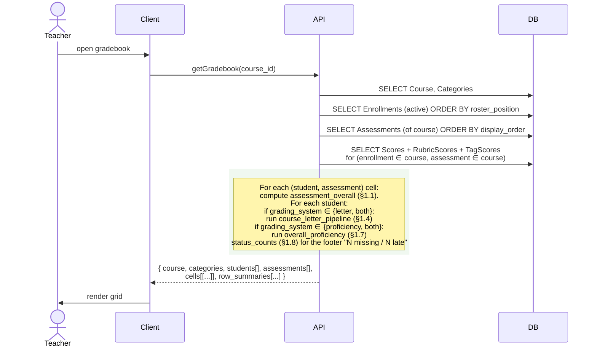
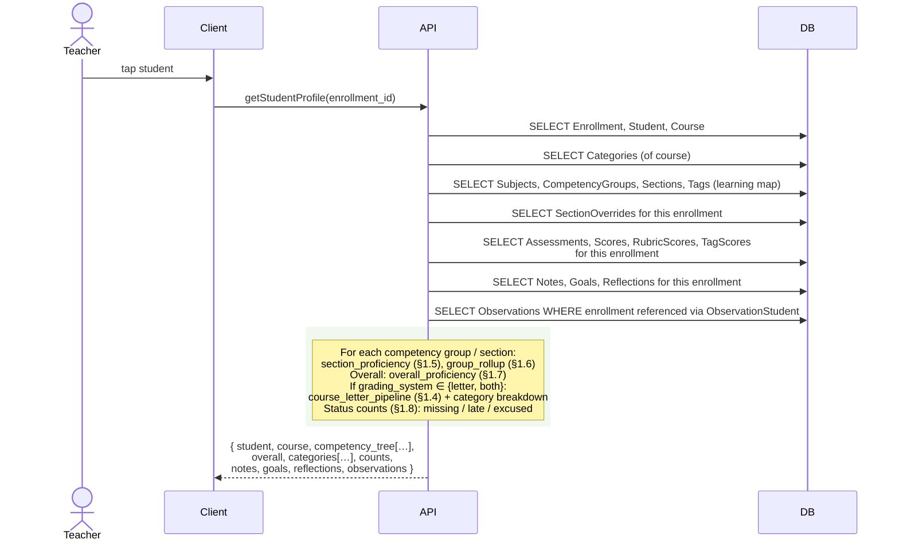
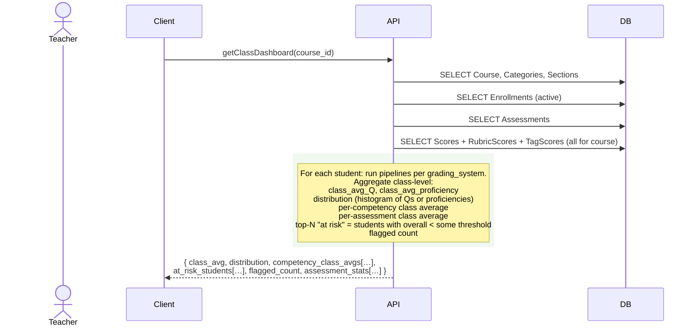
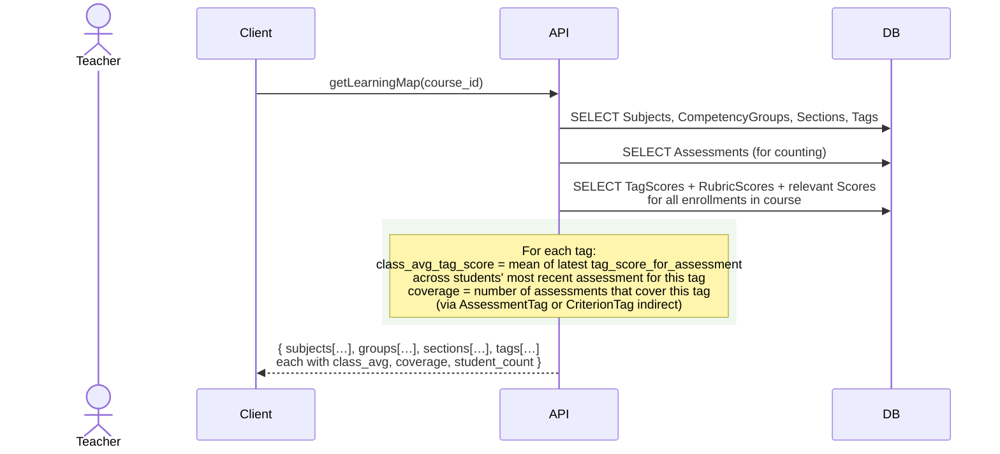
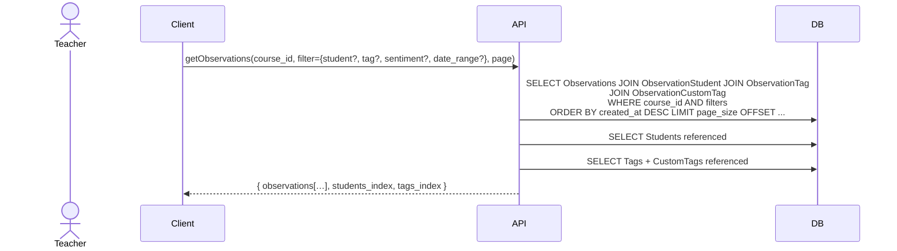
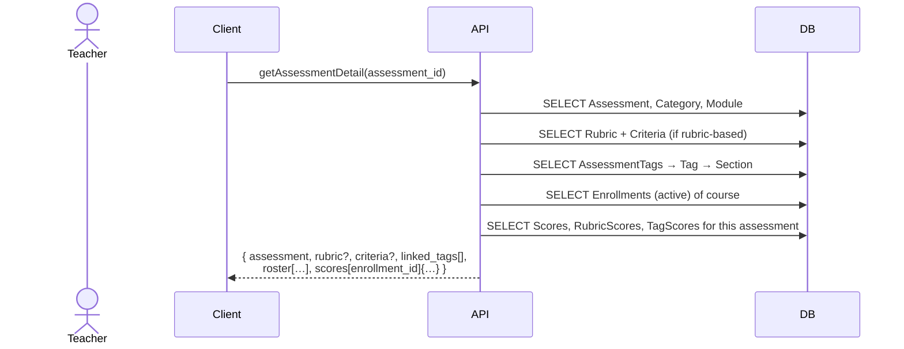

# Pass D — Read Paths and Computation Spec

Pass B specified every way data gets **into** the database. This pass specifies every way data comes **out** — the read surfaces the app renders, and (the harder half) the computations that derive grades, proficiencies, and summary indicators from the raw Score / RubricScore / TagScore rows.

All required schema (Category entity, `Course.grading_system`, `Criterion.weight`, per-level criterion values, etc.) lives in [erd.md](erd.md) — the Pass D amendment was folded into Pass A on 2026-04-19.

## 0. Design rules

- **Aggregates are computed at read time, not stored.** No denormalized "cached grade" columns on Student or Enrollment. This is deliberate: every time the teacher edits a score, any cached aggregate would need invalidation, and that's where the old backend fell apart. Compute on read.
- **Every read surface gets its own API endpoint.** Not one god-query. Surfaces that share data can compose — e.g., gradebook rows reuse the "student overall" shape from the dashboard — but each is a distinct read path with a known shape.
- **Pure functions for computations.** Every aggregate is defined in §1 as a pure function of its inputs. The sequence diagrams in §2 call those functions by name.
- **`grading_system` gates which pipelines run.** A course in `proficiency` mode never computes letter grades (waste), and vice versa. `both` runs both in parallel.

---

## 1. Computation primitives

These are the pure functions. Every read path in §2 calls them. Each is defined with: inputs, output, formula, edge cases.

### 1.1 Assessment overall score

**Purpose:** For a given (student, assessment), what's the student's overall score on this assessment on the 0–4 scale?

**Inputs:**
- `assessment` (with `rubric_id`, `score_mode`, `max_points`)
- Either:
  - `score` (a Score row for this enrollment/assessment), **or**
  - N `rubric_scores` (RubricScore rows) + the Rubric's Criteria (for level values and weights), if rubric-based

**Output:** number on [0, 4] scale, or `null` if not enough data.

**Formula:**

```
function assessment_overall(student, assessment):
    score = Score row where enrollment_id=student AND assessment_id=assessment (if any)

    // Status short-circuits:
    if score exists and score.status == 'EXC':
        return EXCLUDED     // sentinel; caller drops this assessment
    if score exists and score.status == 'NS':
        return 0            // 'NS' = "not submitted", counted as zero
    if no score row exists:
        return NOT_YET_GRADED  // sentinel; caller drops this assessment

    // Rubric-based path:
    if assessment.rubric_id is not null:
        criteria = Criterion rows where rubric_id = assessment.rubric_id
        rubric_scores = RubricScore rows where
                        enrollment_id=student AND assessment_id=assessment
        if rubric_scores is empty:
            return NOT_YET_GRADED

        // Map each criterion score to its level value
        weighted_sum = 0
        total_weight = 0
        for each criterion in criteria:
            rs = rubric_scores for this criterion (if any)
            if rs is null:
                continue   // criterion not scored yet; skip
            value = criterion["level_" + rs.value + "_value"]   // e.g., level_3_value
            weighted_sum += criterion.weight * value
            total_weight += criterion.weight
        if total_weight == 0:
            return NOT_YET_GRADED
        return weighted_sum / total_weight

    // Direct-scored path:
    if score.value is not null:
        if assessment.score_mode == 'proficiency':
            return score.value         // already on 0-4 scale
        if assessment.score_mode == 'points':
            return (score.value / assessment.max_points) * 4   // normalize to 0-4

    return NOT_YET_GRADED
```

**Edge cases:**
- `EXC`, `NS`, and "no row" are distinct sentinels. Callers MUST distinguish them — `NS` (not submitted) counts as 0 (hurts the average); the other two drop the assessment entirely.
- Partial rubric scoring (some criteria scored, others not) still computes an overall score from the scored criteria only. The alternative — requiring all criteria to be scored before showing anything — was rejected because it would leave the gradebook blank during multi-session rubric grading.
- Criterion weights are normalized at read time, not stored normalized. If a teacher gives three criteria weights 1.0/1.0/2.0, they become 0.25/0.25/0.5 at read time.
- `LATE` status has no effect here. Score with `status='LATE'` and `value=3.5` still returns 3.5.

### 1.2 Tag score for an assessment

**Purpose:** For a (student, assessment, tag), derive the student's score on that tag from this assessment.

**Inputs:**
- `student`, `assessment`, `tag`
- If rubric-based: the Rubric's Criteria + CriterionTag rows + RubricScore rows
- If non-rubric: TagScore row

**Output:** number on [0, 4] scale, or `null`.

**Formula:**

```
function tag_score_for_assessment(student, assessment, tag):
    score = Score row for (student, assessment)

    if score.status == 'EXC':
        return EXCLUDED
    if score.status == 'NS':
        return 0
    if no score row:
        return NOT_YET_GRADED

    if assessment.rubric_id is not null:
        // Find all criteria of this rubric that link to this tag
        linking_criteria = Criterion JOIN CriterionTag
                          WHERE rubric_id = assessment.rubric_id AND tag_id = tag
        if linking_criteria is empty:
            return NOT_APPLICABLE   // this assessment doesn't cover this tag
        values = []
        for each criterion in linking_criteria:
            rs = RubricScore row for (student, assessment, criterion)
            if rs exists:
                values.append(criterion["level_" + rs.value + "_value"])
        if values is empty:
            return NOT_YET_GRADED
        return average(values)       // straight average, not weighted by criterion weight
    else:
        ts = TagScore row for (student, assessment, tag)
        if ts is null:
            return NOT_APPLICABLE    // no direct tag score entered
        return ts.value
```

**Edge case — multi-criterion linking:** Per Q2 decision (average, confirmed). If a teacher links criteria A, B, C (weights 1/3 each) to the same Tag, and the student scores 3/4/2 on them, the tag score for this assessment is (3+4+2)/3 = 3.0. Criterion weights (which matter for the rubric's overall score in §1.1) **do not** affect tag derivation.

### 1.3 Category average (percentage pipeline)

**Purpose:** For (student, category), average the student's assessment scores within this category on the 0–4 scale.

**Inputs:** `student`, `category` (with assessments that reference it)

**Output:** number on [0, 4] scale, or `null` if no usable scores.

**Formula:**

```
function category_average(student, category):
    assessments = Assessment rows where category_id = category
    scores = []
    for each assessment in assessments:
        s = assessment_overall(student, assessment)
        if s == EXCLUDED:            continue   // excused, drop
        if s == NOT_YET_GRADED:      continue   // ungraded, drop
        // NS was already mapped to 0 inside assessment_overall
        scores.append(s)
    if scores is empty:
        return null
    return average(scores)
```

**Edge case — all scores excused:** returns null. Caller (§1.4) then drops this category from the overall weighted sum and renormalizes weights across remaining categories.

### 1.4 Course letter/percentage pipeline (Q → R → S)

**Purpose:** For a student, compute the course overall proficiency Q, the percentage R, and the letter grade S.

**Only runs when `course.grading_system ∈ {'letter', 'both'}`.**

**Inputs:** `student`, `course` (with its Categories and Assessments)

**Output:** `{ Q: number|null, R: number|null, S: string|null }`

**Formula:**

```
function course_letter_pipeline(student, course):
    categories = Category rows for course
    if categories is empty:
        // Fallback: no categories → all assessments weighted equally
        assessments = Assessment rows for course
        assessment_scores = []
        for each a in assessments:
            s = assessment_overall(student, a)
            if s in {EXCLUDED, NOT_YET_GRADED}: continue
            assessment_scores.append(s)
        if assessment_scores is empty:
            return { Q: null, R: null, S: null }
        Q = average(assessment_scores)
    else:
        // Category-weighted path (Phil 12 spreadsheet model, corrected for blank-cell policy)
        weighted_sum = 0
        weight_total = 0
        for each category in categories:
            avg = category_average(student, category)
            if avg is null:
                continue          // category dropped
            weighted_sum += category.weight * avg
            weight_total += category.weight
        if weight_total == 0:
            return { Q: null, R: null, S: null }
        Q = weighted_sum / weight_total    // normalized even if weights don't sum to 100

    R = q_to_percentage(Q)
    S = percentage_to_letter(R)
    return { Q, R, S }
```

Helper functions (hardcoded app-wide — BC regional standard):

```
function q_to_percentage(Q):
    // Piecewise-linear map, continuous at the breakpoints
    if Q <= 0:  return 0          // hard floor for exactly 0
    if Q <= 2:  return 55 + (Q - 1) * 13      // Q=1 → 55, Q=2 → 68
    if Q <= 3:  return 68 + (Q - 2) * 14      // Q=2 → 68, Q=3 → 82
    else:       return 82 + (Q - 3) * 14      // Q=3 → 82, Q=4 → 96

function percentage_to_letter(R):
    if R >= 86: return 'A'
    if R >= 73: return 'B'
    if R >= 67: return 'C+'
    if R >= 60: return 'C'
    if R >= 50: return 'C-'
    return 'F'
```

**Key differences from the Phil 12 spreadsheet:**
- Blank cells (no Score row) → **drop from category average**, not counted as zero. Per your decision.
- `status='NS'` (not submitted) → counted as zero. Same effect as the spreadsheet's blank cells, but it's now explicit.
- Category weights that don't sum to 100 → renormalized at read time. Weights summing to 98 yield a sensible percentage. Weights > 100 cannot be saved (UI hard-caps per Q18).

**Display rounding (per Q14 = C):** both proficiency and percentage rendered to **1 decimal place**.
- Q (proficiency) rendered as e.g. `2.7`
- R (percentage) rendered as e.g. `78.6%`
- S (letter) rendered as-is (`B`, `C+`, etc.)
- Intermediate math retains full precision; rounding happens at display only.

**Letter mode without categories (per Q11 = A):** if `grading_system ∈ {'letter', 'both'}` and the course has **zero** Categories, the UI blocks selecting that mode in course settings. The course-creation wizard enforces "create at least one category" before enabling letter mode. The fallback branch below never triggers in practice because the UI prevents that state:

### 1.5 Section (competency) proficiency

**Purpose:** For (student, section), compute the student's proficiency in this competency on the 0–4 scale, using the course's configured `calc_method`.

**Only runs when `course.grading_system ∈ {'proficiency', 'both'}`.**

**Inputs:** `student`, `section`, `course` (for `calc_method` and `decay_weight`)

**Output:** number on [0, 4], or `null` if no evidence.

**Formula:**

```
function section_proficiency(student, section, course):
    // Check for an override first — it fully replaces computed value
    override = SectionOverride row for (student, section)
    if override exists and override.level > 0:
        return override.level

    // Collect ONE contribution per assessment (average its tag scores in this section first)
    // Per Q9 = A: each assessment contributes once, regardless of how many tags it covers.
    tags = Tag rows where section_id = section
    assessments_covering_section = unique set of assessments that score ANY tag in this section
                                   (via AssessmentTag for non-rubric,
                                    or via Rubric→Criterion→CriterionTag for rubric)
    contributions = []      // list of { value, date }
    for each assessment in assessments_covering_section:
        tag_values = []
        for each tag in tags:
            ts = tag_score_for_assessment(student, assessment, tag)
            if ts in {EXCLUDED, NOT_YET_GRADED, NOT_APPLICABLE}: continue
            tag_values.append(ts)
        if tag_values is empty: continue   // assessment covers no scored tag in this section
        contributions.append({ value: mean(tag_values), date: assessment.date_assigned })

    if contributions is empty:
        return null

    // Apply course.calc_method
    switch course.calc_method:
        case 'average':       return mean(contributions.value)
        case 'median':        return median(contributions.value)
        case 'mostRecent':    return contributions sorted by date desc, take first.value
        case 'highest':       return max(contributions.value)
        case 'mode':          return mode(contributions.value, tie-broken by most recent)
        case 'decayingAvg':   return decaying_avg(contributions, course.decay_weight)
```

Helper:

```
function decaying_avg(contributions, dw):
    // contributions sorted oldest to newest
    // new score given weight dw, running average given weight (1-dw)
    if empty: return null
    avg = contributions[0].value
    for i = 1 to contributions.length - 1:
        avg = avg * (1 - dw) + contributions[i].value * dw
    return avg
```

**Design note — one contribution per assessment (per Q9 = A):** Each assessment contributes exactly one entry to `contributions`, computed as the mean of its tag scores within this section. An assessment that covers 5 tags in the section does **not** weight 5× — it counts once, at the average. This matches teacher intuition ("one assignment, one contribution"). An assessment whose tags in this section are all excused/ungraded/not-applicable contributes nothing.

### 1.6 Competency-group rollup

**Purpose:** Average of sections within a competency group.

```
function group_rollup(student, group, course):
    sections = Section rows where competency_group_id = group
    values = []
    for each section in sections:
        p = section_proficiency(student, section, course)
        if p is null: continue
        values.append(p)
    if empty: return null
    return mean(values)
```

### 1.7 Overall proficiency

**Purpose:** Student's overall proficiency across the whole course, on the 0–4 scale.

```
function overall_proficiency(student, course):
    groups = CompetencyGroup rows for course
    if groups is empty:
        // No groups — flat average of sections
        sections = Section rows for course
        values = [section_proficiency(student, s, course) for s in sections]
    else:
        // Groups-of-sections — average of groups (each group = avg of its sections)
        values = [group_rollup(student, g, course) for g in groups]

    values = [v for v in values if v is not null]
    if empty: return null
    return mean(values)
```

### 1.8 Status counts (for dashboards and reports)

**Purpose:** For (student, course) and optionally a term filter, count assessments by status state.

```
function status_counts(student, course, term_filter=null):
    assessments = Assessment rows for course (filtered by term if given)
    counts = { graded: 0, ns: 0, excused: 0, late: 0, not_yet_graded: 0 }
    for each a in assessments:
        s = Score row for (student, a)
        if s is null:
            counts.not_yet_graded += 1
        elif s.status == 'NS':
            counts.ns += 1
        elif s.status == 'EXC':
            counts.excused += 1
        elif s.status == 'LATE':
            counts.late += 1
            if s.value is not null:
                counts.graded += 1   // LATE counts as graded only when a value exists
            else:
                counts.not_yet_graded += 1   // LATE status with no value yet
        elif s.value is not null:
            counts.graded += 1
        else:
            counts.not_yet_graded += 1
    return counts
```

**Note:** `LATE` increments both `late` (informational) and `graded` (because the score exists and counts). This matches the decision that LATE is decorative.

---

## 2. Read surfaces (sequence diagrams)

Each diagram shows the minimal set of entities loaded and which primitives from §1 are called. All reads assume the API has verified the session token (Pass C §8) and confirmed ownership.

### 2.1 Gradebook grid

Trigger: Teacher opens the gradebook page for a course.



**Payload shape:**
- `cells[student_idx][assessment_idx]` — `{ value, status, overall_score, comment_present, has_rubric_scores }`
- `row_summaries[student_idx]` — `{ Q, R, S, overall_proficiency, counts }`

**Not included:** column summaries (class average per assessment) are a separate endpoint — see §2.3.

**Performance note:** one SELECT for each score table; the rest is in-memory composition. Avoid per-cell database round-trips. If the course has 30 students × 50 assessments = 1500 cells, three table scans (Score, RubricScore, TagScore) are cheaper than 1500 point lookups.

### 2.2 Student profile / dashboard

Trigger: Teacher taps a student from the roster. Same shape on mobile and desktop.



**Competency tree shape:**
```
{
  groups: [
    {
      group_id, name, color,
      rollup: 2.7,
      sections: [
        { section_id, name, proficiency: 2.5, override: null,
          tags: [{ tag_id, label, most_recent_score: 3 }] }
      ]
    }
  ]
}
```

**Why one endpoint, not many:** the student profile is the busiest read surface (teacher taps a student frequently). Bundling it avoids the "waterfall of 8 fetches" pattern that commonly destroys performance.

**Course-scoped only — no cross-year carry-forward (per Q42 = B):** the student profile shows **only data from the current Enrollment**. Even though `Student` is teacher-owned (Q41) and the same Student record is reused when re-enrolling in a new course, the profile view in Course B does **not** surface observations, notes, goals, or reflections from Course A. Each course is a sandbox. This keeps the teacher's current-year view focused. Historical context across years can be added later (v2+) as an opt-in "history" panel if teachers request it.

### 2.3 Class dashboard (teacher overview)

Trigger: Teacher opens the course landing page.



**"At risk" threshold (per Q17 = A):** fixed app-wide. A student is flagged "at risk" if either:
- `overall_proficiency < 2.0`, OR
- letter percentage `R < 60%`

Not teacher-configurable in v1 — simpler implementation and consistent experience across teachers. Can be revisited post-launch if teachers request customization.

### 2.4 Learning map view

Trigger: Teacher opens the Learning Map tab for a course. Shows the full competency tree with aggregate class progress per tag.



**What this doesn't include:** per-student proficiency for every tag. That would be huge (30 students × 200 tags = 6000 values). The learning map is a class-level view. Per-student tag proficiency belongs on the student profile (§2.2).

### 2.5 Term rating editor

Trigger: Teacher opens a term rating for (student, term).

```mermaid
sequenceDiagram
    actor Teacher
    participant Client
    participant API
    participant DB

    Client->>API: getTermRating(enrollment_id, term)
    API->>DB: SELECT TermRating (if exists)
    API->>DB: SELECT TermRatingDimension, TermRatingStrength,<br/>TermRatingGrowthArea, TermRatingAssessment, TermRatingObservation
    API->>DB: SELECT Sections (of course; for Dimension editor)
    API->>DB: SELECT Tags (for Strengths / Growth picker)
    API->>DB: SELECT Assessments (for mention picker)
    API->>DB: SELECT Observations (for mention picker)
    rect rgb(240, 248, 240)
    Note over API: Also compute, for context:<br/>overall_proficiency (§1.7),<br/>section_proficiency per section (§1.5),<br/>status_counts (§1.8)
    end
    API-->>Client: { term_rating, suggested_dim_defaults[…],<br/>pickers: {sections, tags, assessments, observations},<br/>context: {overall, sections, counts} }
```

**Suggested dimension defaults:**

- **Current UI behavior:** `upsertTermRating()` at `shared/data.js:4410-4446` creates the dims object with all dimensions defaulted to `0`. Teacher starts from zero.
- **Target behavior (new feature):** when the term rating is new, `TermRatingDimension.rating` is pre-filled with `round(section_proficiency)` for each section. Teacher can accept or override. Reduces re-work for the common case where the auto-computed level is correct.

The backend read endpoint returns the computed defaults regardless. The UI will switch from zero-fill to proficiency-fill when the term-rating editor is updated as part of this rebuild.

**Narrative auto-generate — deferred to external workstream (per Q46 = B + note):** the existing UI has an "auto-generate narrative" button. User has indicated this feature is being developed in a separate repo. For v1 of this rebuild, **hide the button** in the term-rating editor. When the external workstream ships, the feature can be wired back in — it consumes the same computed context (proficiencies, scores, observations) this read endpoint already returns.

### 2.6 Report preview

Trigger: Teacher opens the report preview for (student, course) or prints.

```mermaid
sequenceDiagram
    actor Teacher
    participant Client
    participant API
    participant DB

    Client->>API: getReport(enrollment_id)
    API->>DB: SELECT Course, Student, Enrollment, ReportConfig
    API->>DB: SELECT TermRating (current term)
    API->>DB: SELECT all data backing each enabled block
    rect rgb(240, 248, 240)
    Note over API: For each enabled block in report_config.blocks_config:<br/>  Header: Course + Student metadata, grading_system, current term<br/>  Academic Summary: overall_proficiency + Q/R/S<br/>  Section Outcomes: per-section proficiency + overrides<br/>  Focus Areas: lowest-N sections (or tags with no evidence)<br/>  Completion: status_counts (§1.8); "X late assignments this term"<br/>  Learner Dimensions: TermRating work_habits, participation, social_traits<br/>  Teacher Narrative: TermRating.narrative_html<br/>  Observations: TermRatingObservation mentions + bodies
    end
    API-->>Client: { blocks: [{ type, data }, …] }
```

**One payload per report.** The client renders blocks in order. The backend does not render HTML — it returns structured data and the client handles presentation (so mobile / desktop / print can render differently).

**Late work surfaces here.** Per your decision, LATE is informational and appears in the Completion block: "Student has **N** late assignments this term." Count comes straight from `status_counts(…).late`.

### 2.7 Observation feed

Trigger: Teacher opens the Observations tab (desktop) or Observations feed (mobile).



**No computation.** This is the simplest read surface — pure filtering and join. Included here for completeness.

### 2.8 Assessment detail (score-entry page)

Trigger: Teacher opens an assessment to score it (rubric or direct).



**No summary computation needed.** This surface is for entering scores, not analyzing them.

---

## 3. `grading_system` variants

Every read above branches on `course.grading_system`. To keep it explicit:

| Surface | `proficiency` | `letter` | `both` |
|---|---|---|---|
| 2.1 Gradebook | row summaries show overall proficiency only | row summaries show Q/R/S | show both |
| 2.2 Student profile | competency tree + overall proficiency; hide Q/R/S | categories + Q/R/S; competency tree shown as secondary | both sections rendered |
| 2.3 Class dashboard | proficiency distribution | percentage distribution | both |
| 2.4 Learning map | same in all modes — competencies are universal |
| 2.5 Term rating | proficiency defaults for dimensions | same — TermRatingDimension is proficiency-based regardless of grading_system |
| 2.6 Report | proficiency blocks | percentage/letter blocks | both, per blocks_config |
| 2.7 Observations | unaffected by grading_system |
| 2.8 Assessment detail | score entry UI adapts based on `score_mode` (proficiency vs points), orthogonal to grading_system |

**Flag:** in `both` mode, the UI presentation is **your acknowledged design challenge**. The backend runs both pipelines regardless and surfaces both results in every payload; the client chooses whether to render side-by-side, toggle, or split by block. No data-layer decision required.

---

## 4. Caching and invalidation (recommendation: don't, yet)

Every aggregate in §1 is computed on read. This is deliberate.

**Arguments against caching right now:**
- The old backend's failures came from denormalized aggregates that didn't get invalidated when source data changed. "Compute on read" removes a whole class of bugs.
- The data sizes are small — a class is 30 students × ~100 assessments × ~50 tags. In-memory composition is fast.
- Reads don't need to be faster than ~100ms for any of these surfaces. They just need to be correct.

**When to revisit:**
- If a single class exceeds ~100 students or ~500 assessments, profile reads first.
- If the same aggregate is requested by multiple surfaces within a few seconds (e.g., teacher rapid-taps between students), consider a short-lived in-memory cache at the API layer keyed on `(course_id, max(Score.updated_at))`. Invalidation is then automatic — a fresh write bumps `updated_at`, the cache key changes, the next read recomputes.
- Never introduce a persistent denormalized "overall_grade" column on Enrollment. That's the trap the old backend fell into.

---

## 5. Open questions and flagged decisions

1. ~~Per-tag contribution counting in §1.5.~~ **Resolved (Q9 = A):** one contribution per assessment, computed as the mean of its tag scores in the section. §1.5 formula updated.
2. **"At risk" threshold in §2.3.** Currently defaulted to proficiency < 2.0 or percentage < 60%. Teacher-configurable? Fixed?
3. **No-category, letter-mode fallback in §1.4.** When a course is in `letter` mode with zero Categories, I default to "average all assessments equally." Alternative: require at least one Category before letter mode is selectable. Which is intended?
4. **Report block `Focus Areas` rule.** Current spec (inherited from existing code): lowest-N sections, with zero-evidence sections ranked first. Confirm this is the right ranking.
5. **Decaying-average boundary condition.** With `decay_weight = 0.65`, a single score contributes 65% weight on insertion; with many scores, old ones fade fast. This is the spreadsheet's behavior. Confirm it matches what teachers expect — some gradebooks use the opposite convention (new = 1-dw, running = dw). The formula in §1.5's helper matches the old code.
6. **Per-section calc_method override.** Currently `calc_method` is a course-wide setting. Use cases don't show per-section variation, but it's conceivable a teacher would want "most recent" for one competency and "decaying average" for another. Add later if asked.
7. **Rubric with zero linked criteria for a tag.** If a rubric-based assessment has no criteria linking to a tag, that assessment contributes nothing to that tag's proficiency — treated as `NOT_APPLICABLE`, not zero. Confirm this is the right choice (alternative: still count the assessment, with value = the rubric overall). Current choice is cleaner.


---

> **Last verified 2026-04-20** against `gradebook-prod` + post-merge `main` (Phase 5 doc sweep, reconciliation plan 2026-04-20).
