# Pass B — Write-Path Sequence Diagrams

> **Status:** Shipped. Design reference only. The live SQL is `write-paths.sql` in this directory.

Every persistence boundary — every way user-authored data enters, updates, or leaves the system — is diagrammed below. Mobile and desktop are collapsed; batch variants share a write path with their single-record sibling unless the batch changes the transactional envelope.

Conventions used in every diagram:

- **Actor** is always a Teacher unless stated otherwise.
- **`Client`** = browser (desktop or mobile PWA). It owns no entities; it is the source of the trigger and the target of the response.
- **`API`** = the server-side write boundary (whatever RPC / function the client calls). Transactional scope is the `API`'s responsibility.
- A `rect` block inside a sequence diagram denotes a single atomic transaction — everything inside succeeds or fails as one unit.
- A `Note over …` labelled `CASCADE` marks writes that happen by FK ON DELETE CASCADE (not separately orchestrated by the API).
- Entity names match Pass A.

Authentication, sign-out, delete account, demo mode, and active-course session lifecycle are **deferred to Pass C**. Where a write path (e.g. "delete course" or "clear data") involves account-level lifecycle, only the data-layer writes are diagrammed here.

---

## 0. Open-question dependencies

Several write paths depend on unresolved ERD questions. Each is diagrammed against the current ERD default, with the dependency called out inline.

| ERD Open Question               | Affected write paths                   | Default assumed                                                                                                                                                                                                                         |
| ------------------------------- | -------------------------------------- | --------------------------------------------------------------------------------------------------------------------------------------------------------------------------------------------------------------------------------------- |
| #1 Demo Mode                    | §16.1 only                             | **Resolved (Pass C §6):** demo mode is 100% client-side. Writes in demo never reach the API. All Pass B write paths here describe authenticated, non-demo sessions only. §16.1 is a client-only localStorage reset, not a backend call. |
| #2 Attendance scope             | §4.7 Bulk attendance                   | Attendance is a real persisted entity per ERD. Diagrammed accordingly.                                                                                                                                                                  |
| #3 CustomTag reuse              | §12 CustomTag create; §10 Observations | CustomTag is permanently distinct from Tag — no promotion path.                                                                                                                                                                         |
| #4 Term identifier              | §13 TermRating save                    | `term` is an int 1–6; no TermDefinition entity.                                                                                                                                                                                         |
| #5 Rubric scope                 | §7 Rubrics                             | Rubrics are course-scoped. Duplicate-course (§2.4) copies rubrics.                                                                                                                                                                      |
| #6 Student ownership            | §4 Students; §2.6 Delete course        | Student is teacher-owned. Delete-teacher cascades delete students; delete-course does **not** delete students (only their enrollments).                                                                                                 |
| #7 ObservationTemplate creation | §10.5 Quick-post from template         | Templates are assumed seeded/app-provided — no teacher-facing create/edit path is inventoried. Flagged below.                                                                                                                           |

---

## 1. Teacher preferences

### 1.1 Save any preference (single-field or batched)

Trigger: Teacher toggles desktop view mode, mobile view mode, mobile sort, widget config, or switches active course.

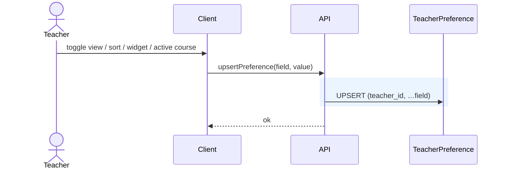

Notes:

- TeacherPreference is 1:1 with Teacher. First write creates the row.
- Active-course switch (rows 27–28, 46) writes only `active_course_id`. No other entity is touched at switch time.
- Mobile card-widget reset (row 52) writes `card_widget_config` back to defaults — same path, different payload.

---

## 2. Course lifecycle

### 2.1 Create course (plain)

Trigger: Teacher submits "New Course" form. Covers rows 18–23.

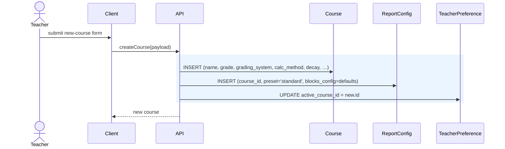

Notes:

- ReportConfig is 1:1 with Course and is created implicitly so the report page has a row to render against.
- Setting the new course as active on create is a UX assumption; if the user already had an active course, the client may skip the preference update. Either way, it rides inside the same transaction.

### 2.2 Create course (wizard)

Trigger: Class wizard, rows 262–269. The wizard collects grade + starter subjects, then "Finish create."

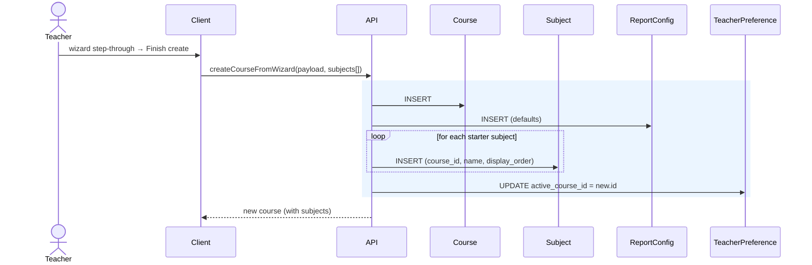

### 2.3 Update course (any field)

Trigger: Teacher edits course name, grade, description, color, grading system, calc method, decay, grading scale, category weights, summative %, report-as-percentage, late-work policy. Rows 24–26, 32–45.

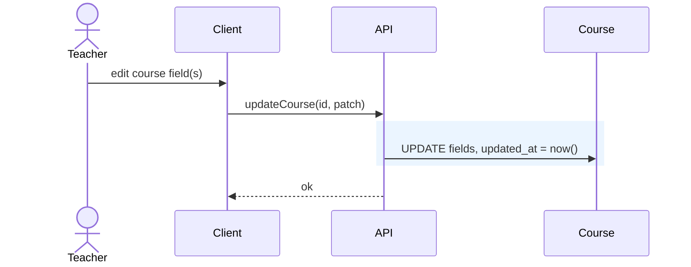

Notes:

- All course-policy fields are columns on Course (per ERD "Merged CoursePolicy into Course"), so one UPDATE covers every policy edit.
- "Reset grading scale" (row 39) writes the default `grading_scale` jsonb back — same path.

### 2.4 Duplicate course

Trigger: Row 29. Copies course structure (subjects/sections/tags/modules/rubrics/criteria/custom tags/observation templates) but not enrollments, scores, observations, or student records.

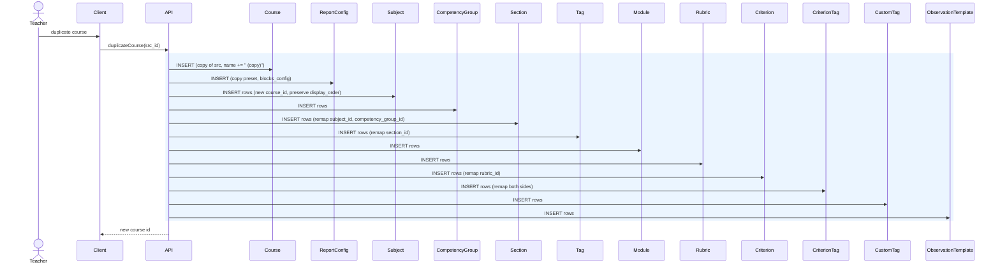

Notes:

- Depends on open question #5 (Rubric scope). Under course-scoped default, rubrics are copied. If rubrics became teacher-scoped, Rubric/Criterion/CriterionTag would drop from this transaction.
- Enrollments, Assessments, Scores, Observations, Notes, Goals, Reflections, SectionOverrides, Attendance, TermRating, and TermRatingDimension are **not** copied — they are student-specific, not structural.

### 2.5 Archive / unarchive course

Trigger: Row 30.

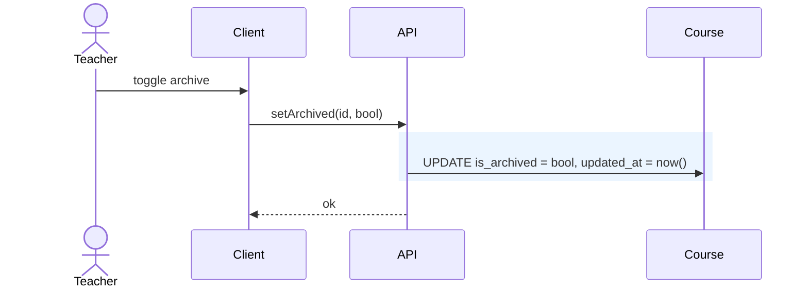

### 2.6 Delete course

Trigger: Row 31. Soft-delete immediately; hard-delete after the 30-day retention window.

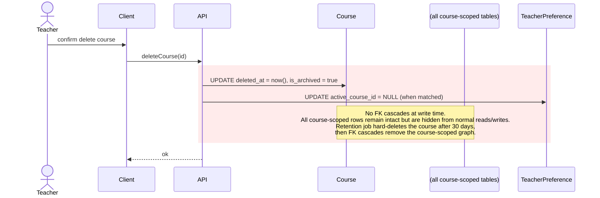

Notes:

- Student rows themselves are **not** deleted — only Enrollment rows that point at this course. A student appearing only in this course remains in the Teacher's student pool.
- This depends on open question #6 (Student ownership). Under the ERD default (Student is teacher-owned, separate from Enrollment), the above holds.
- The course disappears from boot/read surfaces immediately because queries and helper predicates filter `Course.deleted_at is null`.
- The eventual hard-delete is performed by `fv_retention_cleanup()` after the 30-day grace period.

---

## 3. Active-course switch

Handled inline by §1.1 (Save preference). No other entity is touched. No denormalized "last opened" timestamps are kept anywhere.

---

## 4. Students and Enrollment

### 4.1 Add student to course

Trigger: Teacher submits "Add Student" form. Rows 56–63, 83. Creates Student (if new) and Enrollment in one transaction.

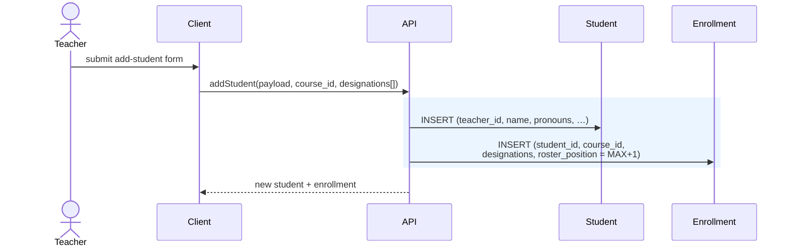

Notes:

- When adding an **existing** student from the teacher's pool to a new course, the Student INSERT is skipped; only Enrollment is written. The client selects the path based on whether the user picked an existing student or entered a new one.
- `roster_position` is appended (MAX(roster_position)+1 within the course) so new students land at the end of the roster.

### 4.2 Edit student

Trigger: Rows 64–70, 83.

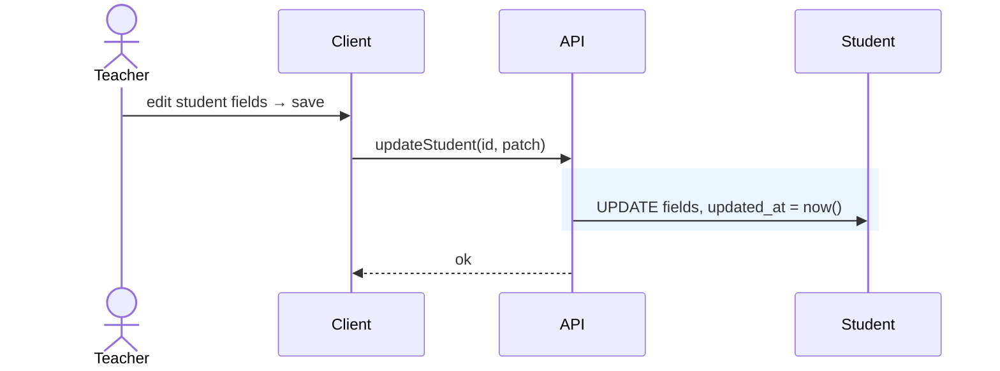

### 4.3 Edit enrollment (designations, flag, position)

Trigger: Row 71 (designations), 171 (flag), 74 (roster drag reorder).

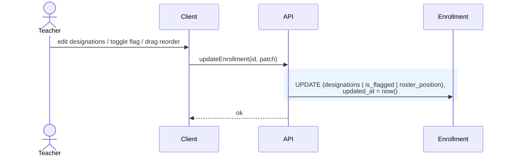

Notes:

- Roster drag reorder (row 74) is a batch variant: a single call sends the new ordered list and the API issues one UPDATE per moved enrollment inside one transaction. Same write path, wider payload.

### 4.4 Withdraw student from course

Trigger: Row 72. Non-destructive — sets `withdrawn_at`.

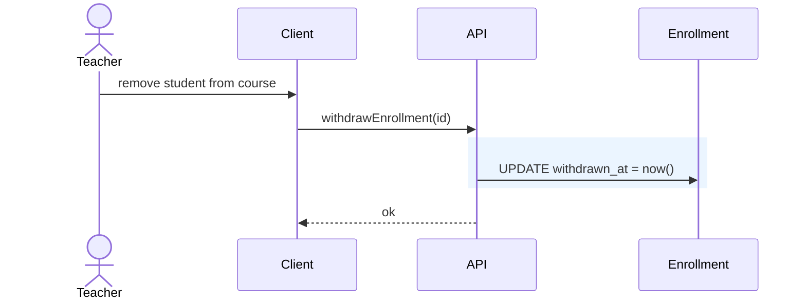

Notes:

- No cascade. Scores, notes, goals, reflections, overrides, attendance, term ratings remain for historical record. Client filters withdrawn enrollments out of active views.
- Re-enrolling the same student is a separate UPDATE setting `withdrawn_at = NULL`.

### 4.5 Delete student (full cascade)

Trigger: Row 73.

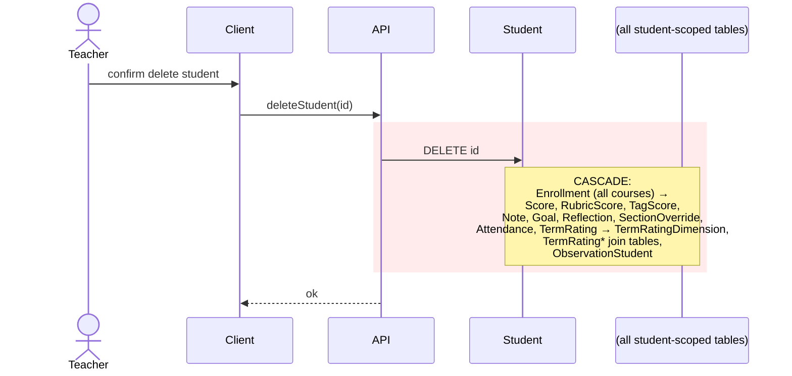

### 4.6 Bulk apply pronouns

Trigger: Row 75. Teacher selects N students, picks a pronoun value, applies.

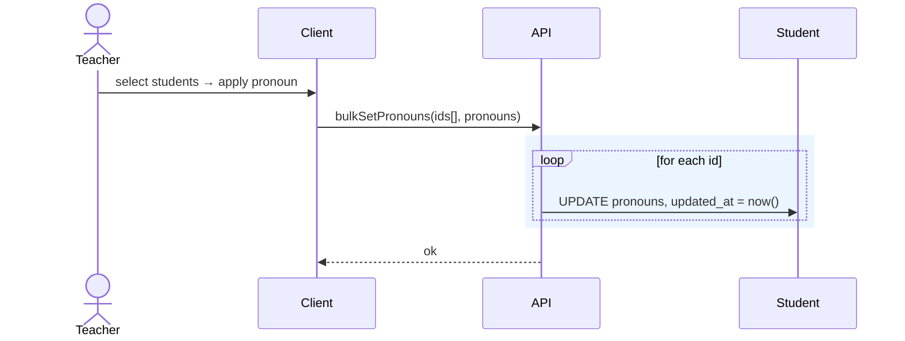

### 4.7 Bulk attendance

Trigger: Rows 76–77. Teacher picks a date, applies a status (Present/Absent/Late) to N students.

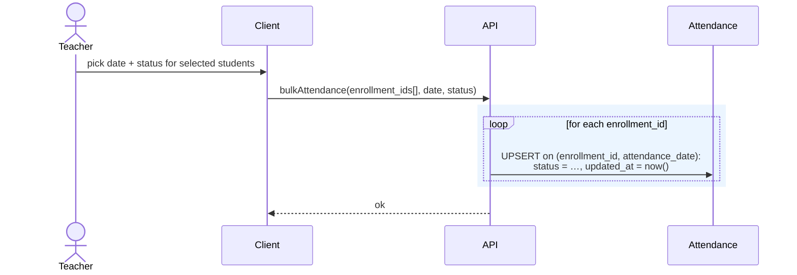

Notes:

- Depends on open question #2 (Attendance scope). Attendance is included per ERD default. If dropped, this path is removed entirely.

---

## 5. Learning map (Subjects, CompetencyGroups, Sections, Tags)

### 5.1 Subject — add / rename / delete

Trigger: Rows 187–189.

```mermaid
sequenceDiagram
    actor Teacher
    participant Client
    participant API
    participant Subject

    alt add
        Teacher->>Client: add subject
        Client->>API: addSubject(course_id, name)
        rect rgb(235, 245, 255)
        API->>Subject: INSERT (course_id, name, display_order = MAX+1)
        end
    else rename
        Teacher->>Client: edit name
        Client->>API: updateSubject(id, patch)
        rect rgb(235, 245, 255)
        API->>Subject: UPDATE name, updated_at
        end
    else delete
        Teacher->>Client: confirm delete
        Client->>API: deleteSubject(id)
        rect rgb(255, 235, 235)
        API->>Subject: DELETE id
        Note over Subject: CASCADE:<br/>Section → Tag → (AssessmentTag,<br/>CriterionTag, ObservationTag,<br/>TermRatingStrength/GrowthArea);<br/>Section → Goal, Reflection,<br/>SectionOverride, TermRatingDimension
        end
    end
    API-->>Client: ok
```

### 5.2 CompetencyGroup — add / edit / delete

Trigger: Rows 201–204.

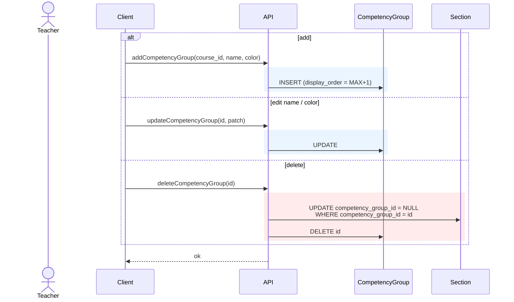

Notes:

- Delete does **not** cascade to Section — groups are decorative. Sections are detached (group set to NULL) and preserved.

### 5.3 Section — add / edit / reassign group / delete

Trigger: Rows 190–194.

```mermaid
sequenceDiagram
    actor Teacher
    participant Client
    participant API
    participant Section

    alt add
        Client->>API: addSection(course_id, subject_id, group_id?, name)
        rect rgb(235, 245, 255)
        API->>Section: INSERT (course_id=subject.course_id,<br/>subject_id, competency_group_id,<br/>display_order = MAX+1 within subject)
        end
    else edit name / subject / group
        Client->>API: updateSection(id, patch)
        rect rgb(235, 245, 255)
        API->>Section: UPDATE name | subject_id | competency_group_id,<br/>updated_at
        Note over Section: Invariant check:<br/>section.course_id = subject.course_id
        end
    else delete
        Client->>API: deleteSection(id)
        rect rgb(255, 235, 235)
        API->>Section: DELETE id
        Note over Section: CASCADE:<br/>Tag → AssessmentTag, CriterionTag,<br/>ObservationTag, TermRatingStrength/GrowthArea;<br/>Goal, Reflection, SectionOverride,<br/>TermRatingDimension
        end
    end
    API-->>Client: ok
```

### 5.4 Tag — edit fields / reorder / delete

Trigger: Rows 197–200. Tags are created implicitly when a Section is created from a template, or explicitly via a tag-add UI (not separately inventoried beyond the edit fields).

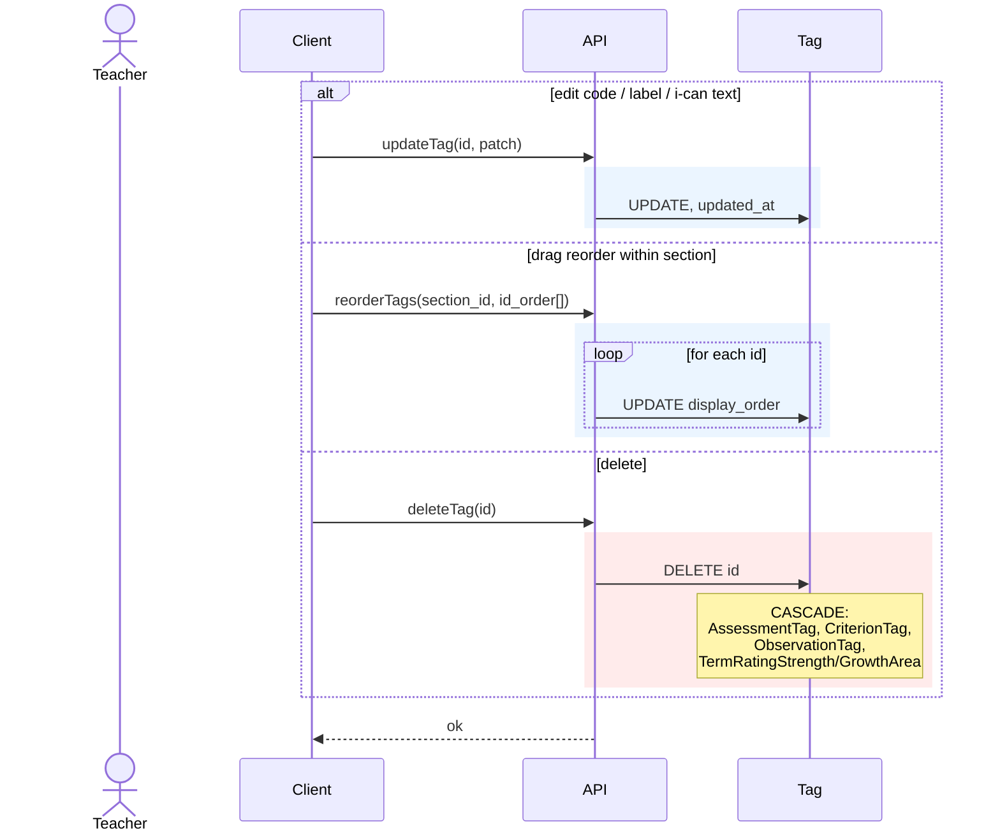

---

## 6. Modules — add / edit / delete

Trigger: Rows 205–208.

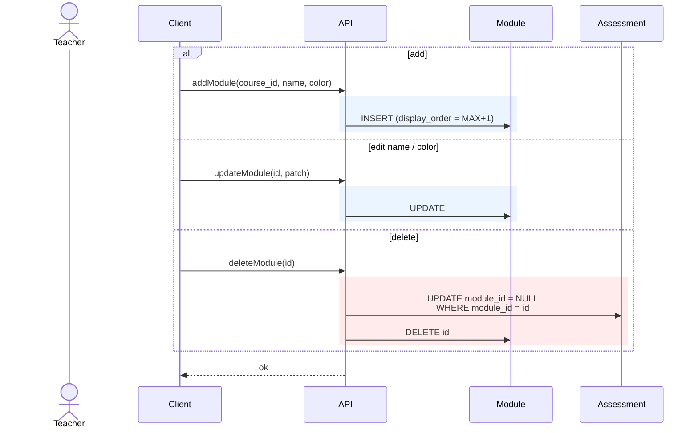

Notes:

- Deleting a module does **not** delete its assessments. Assessments are detached (module_id → NULL) and remain gradebook-visible in the "unmoduled" section.

---

## 7. Rubrics

### 7.1 Save rubric (new or edit)

Trigger: Rows 211–222, 224. The rubric UI is a composite form — rubric name, plus N criterion rows with level descriptors and linked tags, plus add/remove criterion actions. A single "Save rubric" button commits the whole thing.

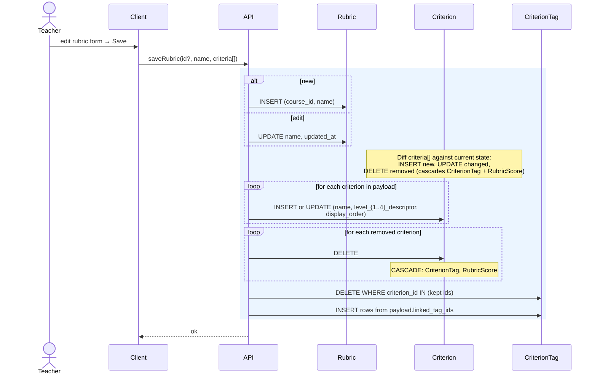

Notes:

- One atomic transaction. Partial saves are not supported — either the whole rubric lands or none of it does.
- "Add criterion" and "Remove criterion" (rows 218–219) are staged in the client until Save; they do not hit the server on their own.
- Editing a rubric that has existing RubricScore rows: if a criterion is deleted, its scores cascade away. The ERD does not prescribe a warning; the API should surface the score-loss count so the client can confirm.

### 7.2 Delete rubric

Trigger: Row 226.

```mermaid
sequenceDiagram
    actor Teacher
    participant Client
    participant API
    participant Rubric
    participant Assessment

    Teacher->>Client: confirm delete rubric
    Client->>API: deleteRubric(id)
    rect rgb(255, 235, 235)
    API->>Assessment: UPDATE rubric_id = NULL WHERE rubric_id = id
    API->>Rubric: DELETE id
    Note over Rubric: CASCADE: Criterion → CriterionTag, RubricScore
    end
    API-->>Client: ok
```

Notes:

- Assessments that referenced the deleted rubric become rubric-less; their existing RubricScore rows are cascade-deleted. The assessment itself survives.

---

## 8. Assessments

### 8.1 Create assessment

Trigger: Rows 86–103. Composite form: metadata + linked tags.

```mermaid
sequenceDiagram
    actor Teacher
    participant Client
    participant API
    participant Assessment
    participant AssessmentTag

    Teacher->>Client: fill new-assessment form → Save
    Client->>API: createAssessment(payload, tag_ids[])
    rect rgb(235, 245, 255)
    API->>Assessment: INSERT (course_id, title, type, score_mode,<br/>max_points, weight, rubric_id, module_id,<br/>collab_mode='none', collab_config=NULL,<br/>display_order = MAX+1 within module scope)
    loop for each tag_id
        API->>AssessmentTag: INSERT (assessment_id, tag_id)
    end
    end
    API-->>Client: new assessment
```

### 8.2 Edit assessment

Trigger: Row 104.

```mermaid
sequenceDiagram
    actor Teacher
    participant Client
    participant API
    participant Assessment
    participant AssessmentTag

    Teacher->>Client: edit fields and/or tags → Save
    Client->>API: updateAssessment(id, patch, tag_ids[])
    rect rgb(235, 245, 255)
    API->>Assessment: UPDATE fields, updated_at
    API->>AssessmentTag: DELETE WHERE assessment_id = id
    loop for each tag_id in new set
        API->>AssessmentTag: INSERT
    end
    end
    API-->>Client: ok
```

Notes:

- Changing `rubric_id` between null and non-null does **not** cascade the old scores. Orphaned RubricScore or TagScore rows should be explicitly deleted before the switch — the API layer is responsible for this pre-step and should warn first. Not diagrammed here as it's a confirmation flow, but the transactional envelope should include the cleanup.

### 8.3 Duplicate assessment

Trigger: Row 105.

```mermaid
sequenceDiagram
    actor Teacher
    participant Client
    participant API
    participant Assessment
    participant AssessmentTag

    Client->>API: duplicateAssessment(src_id)
    rect rgb(235, 245, 255)
    API->>Assessment: INSERT (copy of src, title += " (copy)",<br/>display_order = MAX+1,<br/>collab_config copied)
    API->>AssessmentTag: INSERT (new_id, tag_id)<br/>for each row in src
    end
    API-->>Client: new assessment
```

Notes:

- Scores, RubricScores, TagScores, Observations linking to the original are **not** copied.

### 8.4 Delete assessment

Trigger: Row 106.

```mermaid
sequenceDiagram
    actor Teacher
    participant Client
    participant API
    participant Assessment

    Client->>API: deleteAssessment(id)
    rect rgb(255, 235, 235)
    API->>Assessment: DELETE id
    Note over Assessment: CASCADE:<br/>Score, RubricScore, TagScore,<br/>AssessmentTag, TermRatingAssessment<br/>Observation.assessment_id → NULL (SET NULL, not cascade)
    end
    API-->>Client: ok
```

Notes:

- Observations that cited this assessment as context survive with `assessment_id` set to NULL. Losing all observations when an assessment is deleted would be catastrophic.

### 8.5 Save collab config

Trigger: Rows 108–116. The entire collab panel (mode + excluded IDs + groups) is a single atomic write.

```mermaid
sequenceDiagram
    actor Teacher
    participant Client
    participant API
    participant Assessment

    Teacher->>Client: set mode / exclude / random / manual / drag
    Client->>API: saveCollab(assessment_id, mode, config)
    rect rgb(235, 245, 255)
    API->>Assessment: UPDATE collab_mode = mode,<br/>collab_config = config (or NULL if mode='none'),<br/>updated_at = now()
    end
    API-->>Client: ok
```

Notes:

- Group count +/-, random pairs, random groups, manual assignment, drag-between-groups all compute the new `collab_config` client-side and write it as a single jsonb replacement. No normalized collab tables per ERD.

---

## 9. Scoring

Score, RubricScore, TagScore all live at `(enrollment_id, assessment_id[, criterion_id | tag_id])`. Writes are upserts keyed on the unique constraint.

**Audit trail (per Q28 = A):** every Score upsert writes one row to `ScoreAudit` inside the same transaction, capturing the old and new value/status plus the acting teacher_id and timestamp. Retention: 2 years. This provides a complete change history for dispute resolution. RubricScore and TagScore changes are not audited directly — their effect on computed tag/proficiency values is derivable by walking the audit chain of their parent Score. The transaction rectangle in each diagram below should be read as including the audit write even when not shown explicitly.

### 9.1 Score — single cell (cycle, numeric, inline, mobile)

Trigger: Rows 117–120, 131–134. Teacher clicks/cycles a cell, types a points value, inline-edits, mobile taps.

```mermaid
sequenceDiagram
    actor Teacher
    participant Client
    participant API
    participant Score

    Teacher->>Client: click / cycle / type / tap
    Client->>API: upsertScore(enrollment_id, assessment_id, value)
    rect rgb(235, 245, 255)
    API->>Score: UPSERT on (enrollment_id, assessment_id):<br/>value = …, scored_at = now(), updated_at = now()
    end
    API-->>Client: saved score
```

### 9.2 Score — comment add / replace / delete

Trigger: Rows 121–123.

```mermaid
sequenceDiagram
    actor Teacher
    participant Client
    participant API
    participant Score

    alt add or replace
        Teacher->>Client: type comment → submit
        Client->>API: upsertScoreComment(enrollment_id, assessment_id, text)
        rect rgb(235, 245, 255)
        API->>Score: UPSERT on (enrollment_id, assessment_id):<br/>comment = text, updated_at = now()
        end
    else delete comment
        Teacher->>Client: delete comment
        Client->>API: upsertScoreComment(…, NULL)
        rect rgb(235, 245, 255)
        API->>Score: UPDATE comment = NULL, updated_at = now()
        end
    end
    API-->>Client: ok
```

Notes:

- If no Score row existed, writing a comment creates one with `value = NULL, status = NULL`. A Score row is allowed to carry any subset of `{value, status, comment}`.

### 9.3 Assignment status (NS / EXC / LATE)

Trigger: Rows 141–144.

```mermaid
sequenceDiagram
    actor Teacher
    participant Client
    participant API
    participant Score

    Teacher->>Client: tap status pill
    Client->>API: upsertStatus(enrollment_id, assessment_id, status)
    rect rgb(235, 245, 255)
    API->>Score: UPSERT on (enrollment_id, assessment_id):<br/>status = 'NS' | 'EXC' | 'LATE' | NULL,<br/>updated_at = now()
    end
    API-->>Client: ok
```

Notes:

- Status and value coexist on one row. Setting status to NS does not null out `value`. Teacher decides semantics.

### 9.4 RubricScore — per-criterion entry

Trigger: Row 139. Teacher picks 1–4 on a rubric cell (per criterion).

```mermaid
sequenceDiagram
    actor Teacher
    participant Client
    participant API
    participant RubricScore

    Teacher->>Client: pick 1-4 on criterion cell
    Client->>API: upsertRubricScore(enrollment_id, assessment_id, criterion_id, value)
    rect rgb(235, 245, 255)
    API->>RubricScore: UPSERT on (enrollment_id, assessment_id, criterion_id):<br/>value, updated_at = now()
    end
    API-->>Client: ok
```

Notes:

- Per ERD note: for rubric assessments, tag-level scores are **derived at read time** from RubricScore + CriterionTag. **No TagScore row is written.**

### 9.5 TagScore — per-tag entry

Trigger: Row 140. Only applies when `assessment.rubric_id IS NULL`.

```mermaid
sequenceDiagram
    actor Teacher
    participant Client
    participant API
    participant TagScore

    Teacher->>Client: pick 1-4 on tag cell
    Client->>API: upsertTagScore(enrollment_id, assessment_id, tag_id, value)
    rect rgb(235, 245, 255)
    API->>TagScore: UPSERT on (enrollment_id, assessment_id, tag_id):<br/>value, updated_at = now()
    end
    API-->>Client: ok
```

### 9.6 Fill — rubric "fill all criteria" for a student on an assessment

Trigger: Rows 124–126. Teacher picks a level and applies it to every criterion of an assessment for one student.

```mermaid
sequenceDiagram
    actor Teacher
    participant Client
    participant API
    participant RubricScore

    Teacher->>Client: choose level → Fill all
    Client->>API: fillRubric(enrollment_id, assessment_id, value)
    rect rgb(235, 245, 255)
    loop for each criterion of assessment.rubric
        API->>RubricScore: UPSERT on (enrollment_id, assessment_id, criterion_id): value
    end
    end
    API-->>Client: ok
```

### 9.7 Clear — single cell / full row / full column

Trigger: Rows 127, 128, 129.

```mermaid
sequenceDiagram
    actor Teacher
    participant Client
    participant API
    participant Score
    participant RubricScore
    participant TagScore

    alt clear single cell
        Client->>API: clearScore(enrollment_id, assessment_id)
        rect rgb(255, 235, 235)
        API->>Score: DELETE WHERE enrollment_id = e AND assessment_id = a
        API->>RubricScore: DELETE WHERE …
        API->>TagScore: DELETE WHERE …
        end
    else clear row (all of a student's scores in this course)
        Client->>API: clearRow(enrollment_id, course_id)
        rect rgb(255, 235, 235)
        API->>Score: DELETE WHERE enrollment_id = e AND assessment_id IN (course assessments)
        API->>RubricScore: DELETE WHERE …
        API->>TagScore: DELETE WHERE …
        end
    else clear column (all students' scores on one assessment)
        Client->>API: clearColumn(assessment_id)
        rect rgb(255, 235, 235)
        API->>Score: DELETE WHERE assessment_id = a
        API->>RubricScore: DELETE WHERE …
        API->>TagScore: DELETE WHERE …
        end
    end
    API-->>Client: ok
```

Notes:

- Each clear variant is one atomic transaction across the three scoring tables.
- "Undo score change" (row 130) is a client-side operation that reads the prior value from an undo buffer and re-issues an upsert via §9.1. Not a separate write path.

---

## 10. Observations

### 10.1 Create observation (desktop or mobile)

Trigger: Rows 145–154. Capture-bar composite form: body, sentiment, context, linked students, linked tags, optional linked custom tags.

```mermaid
sequenceDiagram
    actor Teacher
    participant Client
    participant API
    participant Observation
    participant ObservationStudent
    participant ObservationTag
    participant ObservationCustomTag

    Teacher->>Client: fill capture → Save
    Client->>API: createObservation(payload, enrollment_ids[], tag_ids[], custom_tag_ids[])
    rect rgb(235, 245, 255)
    API->>Observation: INSERT (course_id, body, sentiment,<br/>context_type, assessment_id?)
    loop for each enrollment_id
        API->>ObservationStudent: INSERT
    end
    loop for each tag_id
        API->>ObservationTag: INSERT
    end
    loop for each custom_tag_id
        API->>ObservationCustomTag: INSERT
    end
    end
    API-->>Client: new observation
```

Notes:

- Dimension tag toggle (row 147) and context toggle (149–150) are staged client-side until submit. They alter the payload, not separate write paths.
- "Remove capture student/tag" (rows 151–152) are pre-submit client operations.

### 10.2 Edit observation

Trigger: Rows 155–156.

```mermaid
sequenceDiagram
    actor Teacher
    participant Client
    participant API
    participant Observation
    participant ObservationStudent
    participant ObservationTag
    participant ObservationCustomTag

    Client->>API: updateObservation(id, patch, enrollment_ids, tag_ids, custom_tag_ids)
    rect rgb(235, 245, 255)
    API->>Observation: UPDATE body, sentiment, context_type, assessment_id,<br/>updated_at = now()
    API->>ObservationStudent: DELETE WHERE observation_id = id
    loop for each enrollment_id
        API->>ObservationStudent: INSERT
    end
    API->>ObservationTag: DELETE + re-INSERT
    API->>ObservationCustomTag: DELETE + re-INSERT
    end
    API-->>Client: ok
```

Notes:

- Delete-then-reinsert on the three join tables is the simplest atomic way to replace a set. Optimising to a diff is permissible but not required.

### 10.3 Delete observation

Trigger: Rows 157–158.

```mermaid
sequenceDiagram
    actor Teacher
    participant Client
    participant API
    participant Observation

    Client->>API: deleteObservation(id)
    rect rgb(255, 235, 235)
    API->>Observation: DELETE id
    Note over Observation: CASCADE:<br/>ObservationStudent, ObservationTag,<br/>ObservationCustomTag, TermRatingObservation
    end
    API-->>Client: ok
```

### 10.4 Quick-post from template (mobile)

Trigger: Row 159. Teacher picks a template; the template's body + defaults pre-fill a capture, and the teacher supplies at least the target student before sending. The posted row is a regular Observation.

```mermaid
sequenceDiagram
    actor Teacher
    participant Client
    participant API
    participant ObservationTemplate
    participant Observation
    participant ObservationStudent
    participant ObservationTag

    Teacher->>Client: tap template → pick student → post
    Client->>ObservationTemplate: (read) fetch body, defaults, template tags
    Client->>API: createObservation(body, defaults, enrollment_ids, tag_ids)
    rect rgb(235, 245, 255)
    API->>Observation: INSERT
    API->>ObservationStudent: INSERT per enrollment
    API->>ObservationTag: INSERT per tag
    end
    API-->>Client: new observation
```

Notes:

- No write is made back to the ObservationTemplate row on quick-post. Usage counts / last-used timestamps are not in the ERD.

### 10.5 Teacher-added custom templates (Q4 = B)

Per final decision: the app ships with 6–10 curated seed templates (`is_seed = true`, immutable). Teachers can **add** their own custom templates but cannot edit or delete seeds.

```mermaid
sequenceDiagram
    actor Teacher
    participant Client
    participant API
    participant ObservationTemplate

    alt create custom template
        Teacher->>Client: fill template form (body, default_sentiment, default_context_type, optional tags)
        Client->>API: createCustomTemplate(course_id, payload)
        rect rgb(235, 245, 255)
        API->>ObservationTemplate: INSERT (course_id, body, default_*,<br/>is_seed = false,<br/>display_order = MAX+1)
        end
    else edit custom template
        Teacher->>Client: edit fields → Save
        Client->>API: updateCustomTemplate(id, patch)
        rect rgb(235, 245, 255)
        API->>ObservationTemplate: UPDATE WHERE id = target AND is_seed = false<br/>(returns 403 if seed)
        end
    else delete custom template
        Client->>API: deleteCustomTemplate(id)
        rect rgb(255, 235, 235)
        API->>ObservationTemplate: DELETE WHERE id = target AND is_seed = false
        end
    end
    API-->>Client: ok
```

Notes:

- The API enforces `is_seed = false` on every mutation. Seeds are protected at the database level too via an RLS policy: `USING (is_seed = false)`.
- Seed templates are inserted at schema-migration time, not by teachers. Updating seeds is a deployment operation.

---

## 11. Student-scoped records

### 11.1 Note — add / delete (immutable)

Trigger: Rows 168, 170.

```mermaid
sequenceDiagram
    actor Teacher
    participant Client
    participant API
    participant Note

    alt add
        Teacher->>Client: type note → submit
        Client->>API: addNote(enrollment_id, body)
        rect rgb(235, 245, 255)
        API->>Note: INSERT (enrollment_id, body, created_at = now())
        end
    else delete
        Client->>API: deleteNote(id)
        rect rgb(255, 235, 235)
        API->>Note: DELETE id
        end
    end
    API-->>Client: ok
```

Notes:

- Per ERD: Notes are immutable (no edit). Only add and delete.

### 11.2 Toggle flag

Trigger: Row 171. Diagrammed under §4.3 (edit enrollment) — `is_flagged` column.

### 11.3 Goal — save (upsert per section)

Trigger: Rows 173–174. UNIQUE(enrollment_id, section_id).

```mermaid
sequenceDiagram
    actor Teacher
    participant Client
    participant API
    participant Goal

    Client->>API: saveGoal(enrollment_id, section_id, body)
    rect rgb(235, 245, 255)
    API->>Goal: UPSERT on (enrollment_id, section_id):<br/>body, updated_at = now()
    end
    API-->>Client: ok
```

### 11.4 Reflection — save (upsert per section)

Trigger: Rows 177–179. UNIQUE(enrollment_id, section_id).

```mermaid
sequenceDiagram
    actor Teacher
    participant Client
    participant API
    participant Reflection

    Client->>API: saveReflection(enrollment_id, section_id, body, confidence)
    rect rgb(235, 245, 255)
    API->>Reflection: UPSERT on (enrollment_id, section_id):<br/>body, confidence, updated_at = now()
    end
    API-->>Client: ok
```

### 11.5 SectionOverride — save / clear

Trigger: Rows 182–185.

```mermaid
sequenceDiagram
    actor Teacher
    participant Client
    participant API
    participant SectionOverride

    alt save
        Client->>API: saveOverride(enrollment_id, section_id, level, reason)
        rect rgb(235, 245, 255)
        API->>SectionOverride: UPSERT on (enrollment_id, section_id):<br/>level, reason, updated_at = now()
        end
    else clear
        Client->>API: clearOverride(enrollment_id, section_id)
        rect rgb(255, 235, 235)
        API->>SectionOverride: DELETE WHERE enrollment_id = e AND section_id = s
        end
    end
    API-->>Client: ok
```

---

## 12. CustomTag — create

Trigger: Row 229. No edit or delete path inventoried.

```mermaid
sequenceDiagram
    actor Teacher
    participant Client
    participant API
    participant CustomTag

    Teacher->>Client: type new custom tag label
    Client->>API: createCustomTag(course_id, label)
    rect rgb(235, 245, 255)
    API->>CustomTag: INSERT (course_id, label, created_at)
    end
    API-->>Client: new custom tag
```

Notes:

- Open question #3: custom tags are permanently distinct from Tag per ERD default. No promotion path is diagrammed.
- The inputs don't cover custom-tag delete; if added later, a delete path would cascade ObservationCustomTag.

---

## 13. TermRating

Trigger: Rows 230–241. Term ratings are edited as a composite form per (enrollment, term). UNIQUE(enrollment_id, term). The full form is saved as one transaction.

**Audit trail (per Q28 = A):** every change to a TermRating field (narrative_html, work_habits_rating, participation_rating, social_traits, each Dimension rating, each join-table membership) writes one row to `TermRatingAudit` inside the same transaction. One audit row per changed field. Retention: 2 years. The diagram below shows the audit write as a single `API->>TermRatingAudit: INSERT per changed field` step for brevity; implementation computes the diff against the prior state.

```mermaid
sequenceDiagram
    actor Teacher
    participant Client
    participant API
    participant TermRating
    participant TermRatingDimension
    participant TermRatingStrength
    participant TermRatingGrowthArea
    participant TermRatingAssessment
    participant TermRatingObservation

    Teacher->>Client: edit narrative / ratings / traits / mentions → Save
    Client->>API: saveTermRating(enrollment_id, term, payload)
    rect rgb(235, 245, 255)
    API->>TermRating: UPSERT on (enrollment_id, term):<br/>narrative_html, work_habits_rating,<br/>participation_rating, social_traits,<br/>updated_at = now()
    API->>TermRatingDimension: DELETE WHERE term_rating_id = tr
    loop for each section rating in payload
        API->>TermRatingDimension: INSERT (term_rating_id, section_id, rating)
    end
    API->>TermRatingStrength: DELETE + re-INSERT from payload.strength_tag_ids
    API->>TermRatingGrowthArea: DELETE + re-INSERT from payload.growth_tag_ids
    API->>TermRatingAssessment: DELETE + re-INSERT from payload.mention_assessment_ids
    API->>TermRatingObservation: DELETE + re-INSERT from payload.mention_observation_ids
    end
    API-->>Client: ok
```

Notes:

- Depends on open question #4. Under ERD default, `term` is an int 1–6 — no FK, no TermDefinition join.
- "Auto-generate narrative" (row 232) produces HTML client-side (or via an AI call outside the entity model) and feeds `narrative_html` into the same save path. Not a separate write path.
- "Copy narrative" (row 233) is clipboard — not a write.

---

## 14. ReportConfig

Trigger: Rows 245–246.

```mermaid
sequenceDiagram
    actor Teacher
    participant Client
    participant API
    participant ReportConfig

    alt apply preset
        Teacher->>Client: pick brief / standard / detailed
        Client->>API: setReportPreset(course_id, preset)
        rect rgb(235, 245, 255)
        API->>ReportConfig: UPSERT on course_id:<br/>preset, blocks_config = preset defaults,<br/>updated_at = now()
        end
    else toggle individual block
        Client->>API: toggleReportBlock(course_id, block_key, enabled)
        rect rgb(235, 245, 255)
        API->>ReportConfig: UPSERT on course_id:<br/>blocks_config[block_key] = enabled,<br/>preset = 'custom',<br/>updated_at = now()
        end
    end
    API-->>Client: ok
```

Notes:

- Any manual block toggle implicitly switches `preset` to `'custom'` — otherwise the displayed preset would misrepresent the active layout.
- ReportConfig exists 1:1 with Course and is created at course-create time (§2.1, §2.2). Subsequent writes are always UPDATEs in practice, but the API uses UPSERT to tolerate the rare case where the row was not seeded.

---

## 15. Imports

### 15.1 Class roster CSV import

Trigger: Rows 256–257. Teacher uploads CSV, reviews parsed rows, confirms.

```mermaid
sequenceDiagram
    actor Teacher
    participant Client
    participant API
    participant Student
    participant Enrollment

    Teacher->>Client: upload CSV → review → Confirm import
    Client->>API: importRoster(course_id, rows[])
    rect rgb(235, 245, 255)
    loop for each row
        alt row matches existing student by student_number/email
            API->>Enrollment: INSERT (student_id, course_id, designations)
        else new student
            API->>Student: INSERT
            API->>Enrollment: INSERT
        end
    end
    end
    API-->>Client: summary (N created, N re-enrolled)
```

Notes:

- Matching strategy (by student_number, email, or name) is an API-layer policy decision; not an ERD concern. Defaulting to student_number per typical SIS convention.

### 15.2 Teams file import

Trigger: Rows 259–261. Imports a whole class — course, students, assessments — from a Microsoft Teams export.

```mermaid
sequenceDiagram
    actor Teacher
    participant Client
    participant API
    participant Course
    participant ReportConfig
    participant Student
    participant Enrollment
    participant Assessment
    participant TeacherPreference

    Teacher->>Client: pick file → name class → select assignments → Import
    Client->>API: importTeams(file_payload, class_name, selected_assignment_ids[])
    rect rgb(235, 245, 255)
    API->>Course: INSERT (name = class_name, defaults for grading)
    API->>ReportConfig: INSERT (defaults)
    loop for each student in payload
        API->>Student: INSERT or match existing
        API->>Enrollment: INSERT (course_id, student_id)
    end
    loop for each selected assignment
        API->>Assessment: INSERT (course_id, title, type, score_mode, …)
    end
    API->>TeacherPreference: UPDATE active_course_id = new.id
    end
    API-->>Client: summary
```

Notes:

- Scores are **not** imported from Teams in this flow — only the structure (class, roster, assignment list). If Teams files eventually include score data, a §15.2-extended path would upsert Score rows within the same transaction.

### 15.3 JSON full-data import

Trigger: Row 254. Legacy export-import restore.

```mermaid
sequenceDiagram
    actor Teacher
    participant Client
    participant API
    participant DB as (every entity)

    Teacher->>Client: pick JSON → Confirm
    Client->>API: importJson(payload)
    rect rgb(235, 245, 255)
    Note over API,DB: Replay order (FK-safe):<br/>Course → ReportConfig → Subject/CompetencyGroup/Module →<br/>Section → Tag → Rubric → Criterion → CriterionTag →<br/>Student → Enrollment → Assessment → AssessmentTag →<br/>Score / RubricScore / TagScore →<br/>Observation → Observation* joins →<br/>CustomTag → ObservationCustomTag →<br/>Note / Goal / Reflection / SectionOverride / Attendance →<br/>TermRating → TermRatingDimension + TermRating* joins →<br/>ObservationTemplate
    API->>DB: INSERT or UPSERT in topological order
    end
    API-->>Client: summary
```

Notes:

- Treated as one atomic transaction. A partial import is worse than no import.
- "UPSERT" semantics versus "INSERT only" is a policy question: does JSON import merge into existing data or require a clean slate? The ERD doesn't prescribe. Defaulting to UPSERT keyed on UUIDs, so re-importing the same file is idempotent.

### 15.4 Relink confirm

Trigger: Row 271. After an import, a student that should exist in a prior course but didn't match is reconciled.

```mermaid
sequenceDiagram
    actor Teacher
    participant Client
    participant API
    participant Enrollment
    participant Student

    Teacher->>Client: pick "this is the same student" → Confirm
    Client->>API: relinkStudent(ghost_student_id, canonical_student_id)
    rect rgb(235, 245, 255)
    API->>Enrollment: UPDATE student_id = canonical_id<br/>WHERE student_id = ghost_id
    API->>Student: DELETE id = ghost_id
    Note over Student: ghost has no remaining references<br/>after Enrollment reassignment
    end
    API-->>Client: ok
```

Notes:

- Any student-scoped rows (notes, goals, etc.) are already attached via Enrollment and move with the enrollment reassignment — no per-table rewrite needed.

---

## 16. Data management

### 16.1 Reset demo data (client-only)

Trigger: Row 309. Only meaningful in demo mode. **This is not a backend write path** — demo mode is entirely client-side (see Pass C §6). No API call is made.

```mermaid
sequenceDiagram
    actor Visitor
    participant Client
    participant LS as Local Storage
    participant Seed as Static Seed (bundled with client)

    Visitor->>Client: Reset demo data → Confirm
    Client->>LS: DELETE demo-data slot
    Client->>Seed: reload seed JSON
    Client->>LS: write fresh seed into demo-data slot
    Client->>Client: re-render seeded course
```

Notes:

- In authenticated (non-demo) sessions, the "Reset demo data" action is not available — the button is hidden by the client when `gb-demo-mode` is not set.
- The seed is a static JSON file bundled with the client build. It is not fetched from the API and does not require authentication.

### 16.2 Clear data

Trigger: Row 310. Full wipe — leaves the Teacher row intact, deletes everything they own.

```mermaid
sequenceDiagram
    actor Teacher
    participant Client
    participant API
    participant DB as (all teacher-scoped tables)

    Teacher->>Client: Clear data → type-confirm
    Client->>API: clearData()
    rect rgb(255, 235, 235)
    API->>DB: DELETE FROM Course WHERE teacher_id = caller<br/>(cascades to every course-scoped entity)
    API->>DB: DELETE FROM Student WHERE teacher_id = caller<br/>(cascades to Enrollment and all student-scoped rows,<br/>though most are already gone via Course cascade)
    API->>DB: UPDATE TeacherPreference SET active_course_id = NULL
    end
    API-->>Client: ok
```

Notes:

- Delete-account (row 16) is a Pass C concern. It extends this path with a delete of the Teacher row itself, which cascades TeacherPreference.

---

## 17. Input coverage audit

Every non-ephemeral input row from `All Inputs` is covered below. Rows excluded as pure UI state are listed in the ERD's "Rows excluded as pure UI state" table and not repeated here.

| Row(s)            | Write path                          |
| ----------------- | ----------------------------------- |
| 1–16              | Pass C (auth lifecycle)             |
| 17                | Pass C (demo session flag)          |
| 18–23             | §2.1 Create course                  |
| 24–26, 32–45      | §2.3 Update course                  |
| 27–28, 46         | §1.1 / §3 Active course switch      |
| 29                | §2.4 Duplicate course               |
| 30                | §2.5 Archive                        |
| 31                | §2.6 Delete course                  |
| 48–53             | §1.1 Preferences                    |
| 56–62, 83         | §4.1 Add student                    |
| 63                | §4.1 (designations on add)          |
| 64–70             | §4.2 Edit student                   |
| 71                | §4.3 Edit enrollment (designations) |
| 72                | §4.4 Withdraw                       |
| 73                | §4.5 Delete student                 |
| 74                | §4.3 (roster reorder batch)         |
| 75                | §4.6 Bulk pronouns                  |
| 76–77             | §4.7 Bulk attendance                |
| 86–103            | §8.1 Create assessment              |
| 104               | §8.2 Edit assessment                |
| 105               | §8.3 Duplicate assessment           |
| 106               | §8.4 Delete assessment              |
| 108–116           | §8.5 Save collab config             |
| 117–120, 131–134  | §9.1 Score single cell              |
| 121–123           | §9.2 Score comment                  |
| 124–126           | §9.6 Fill rubric                    |
| 127               | §9.7 Clear cell                     |
| 128               | §9.7 Clear row                      |
| 129               | §9.7 Clear column                   |
| 130               | §9.1 (undo via re-upsert)           |
| 139               | §9.4 RubricScore                    |
| 140               | §9.5 TagScore                       |
| 141–144           | §9.3 Assignment status              |
| 145–154           | §10.1 Create observation            |
| 155–156           | §10.2 Edit observation              |
| 157–158           | §10.3 Delete observation            |
| 159               | §10.4 Quick-post from template      |
| 168               | §11.1 Add note                      |
| 170               | §11.1 Delete note                   |
| 171               | §11.2 → §4.3 Toggle flag            |
| 173–174           | §11.3 Goal                          |
| 177–179           | §11.4 Reflection                    |
| 182–184           | §11.5 Save override                 |
| 185               | §11.5 Clear override                |
| 187–189           | §5.1 Subject                        |
| 190–194           | §5.3 Section                        |
| 197–200           | §5.4 Tag                            |
| 201–204           | §5.2 CompetencyGroup                |
| 205–208           | §6 Module                           |
| 211–219, 222, 224 | §7.1 Save rubric                    |
| 226               | §7.2 Delete rubric                  |
| 229               | §12 CustomTag create                |
| 230–241           | §13 TermRating save                 |
| 245–246           | §14 ReportConfig                    |
| 254               | §15.3 JSON import                   |
| 256–257           | §15.1 Roster CSV                    |
| 259–261           | §15.2 Teams import                  |
| 262–263, 269      | §2.2 Wizard create                  |
| 271               | §15.4 Relink                        |
| 309               | §16.1 Reset demo                    |
| 310               | §16.2 Clear data                    |

---

> **Last verified 2026-04-20** against `gradebook-prod` + post-merge `main` (Phase 5 doc sweep, reconciliation plan 2026-04-20).
